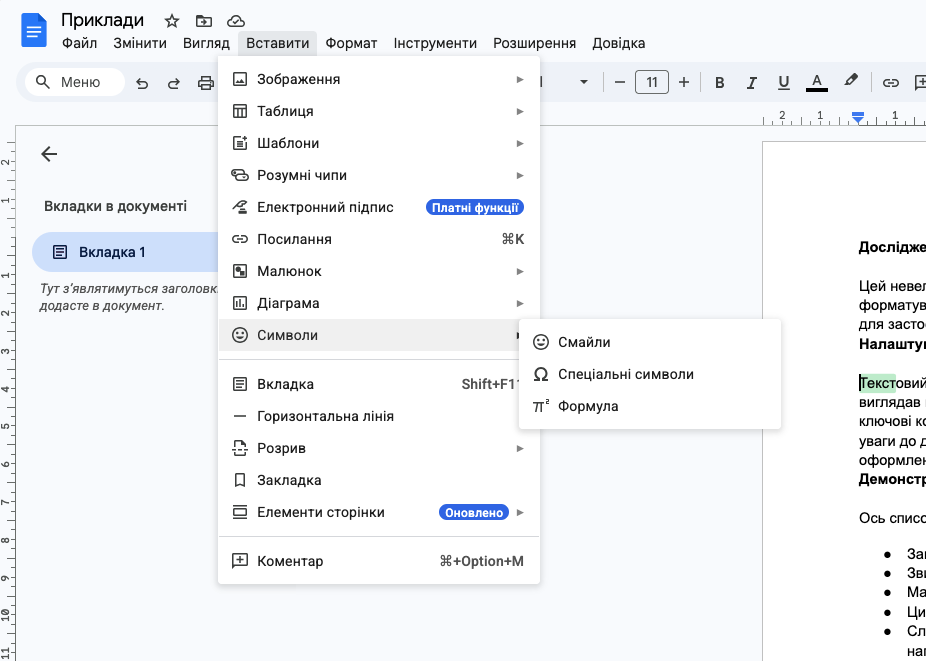
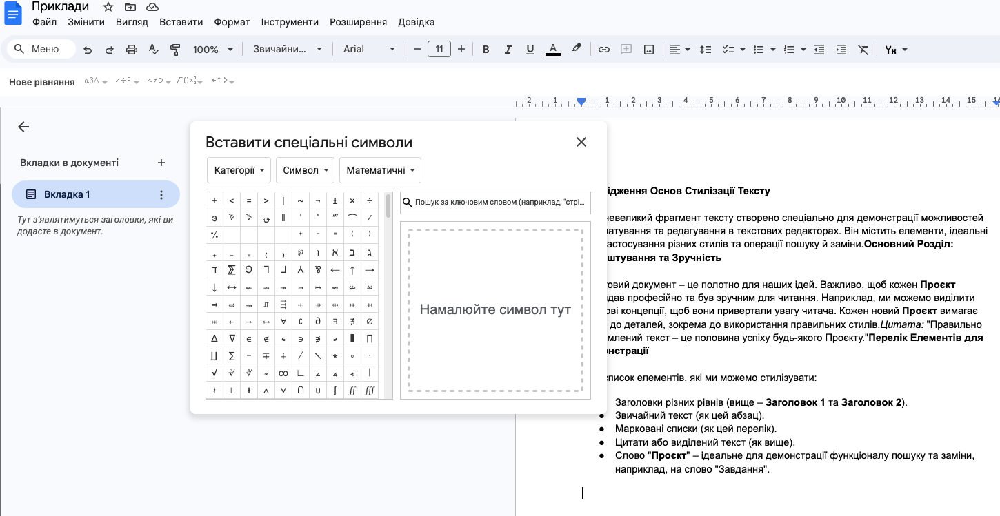

# Додавання символів та формул

## 🏫 Урок №37

---

## 🎯 Сьогодні ми дізнаємося

- 📦 Які можливості дає меню **Вставити**.
- ✨ Як додавати символи, яких немає на клавіатурі.
- ➗ Як створювати складні математичні формули.

---

## 📥 Що можна "Вставити"?

  

    

🖼️ Зображення: фото та малюнки.
    

    

📊 Таблиці: табличні дані.
    

    

🔗 Посилання: перехід на сайти.
    

    

🔢 Символи: знаки (напр. ©, ±).
    

    

📐 Фjрмули: складні формули.
    

  

  

   

  

---

## 🧩 Спеціальні символи

Де знайти знаки на кшталт **©, ®, ±, ∞**?

  

1. Перейдіть у меню **Вставити**.
2. Оберіть пункт **Символ**.
3. Натисніть **Спеціальні символи**, щоб відкрити повну таблицю знаків.

  

  

  

---

## 📐 Математичні формули

Для запису дробів, коренів чи степенів:

- Шлях: `Вставити` ➡️ `Символи` ➡️️ `Формула`️
- Коли курсор у полі рівняння, використовуйте панель **Конструктор** (зверху) для вибору шаблонів: $\frac{x}{y}$, $\sqrt{x}$, $x^n$.

---

## 📝 Важливо запам'ятати

- **Меню «Вставити»** — додає об’єкти, яких немає у звичайному наборі тексту (зображення, посилання, формули).
- **Символи** — знаки, відсутні на клавіатурі.
- **Редактор рівнянь** — інструмент для створення правильних математичних записів.

---

## 🛠️ Практичне завдання

Скористайтеся меню

1. Створіть новий документ [Документи Google](https://docs.google.com/)
2. Змініть назву на `ВАШЕ_ІМʼЯ_символи_і_формули`
3. Використайте меню `Вставити` ➡️ `Символи` ➡️️ `Спеціальні символи` щоб додати наступні символи (знайдіть в таблиці чи скористайтеся пошуком):
   - `±` (plus minus)
   - `≠` (not equal)
   - `©` (copyright)
   - `∞` (infinity).
4. Використайте меню `Вставити` ➡️ `Символи` ➡️️ `Формула` щоб додати формули $x = \frac{1}{2} \sqrt{16}$.
5. **Посилання:** Зробіть слово "Вікіпедія" гіперпосиланням на сайт `uk.wikipedia.org`.

---

## 🏠 Домашнє завдання

1. Відкрийте [**Google Документи**](https://docs.google.com/).
2. Створіть новий документ
3. Додайте в нього формулу дискримінанту: **$D = b^2 - 4ac$**.
4. Зробіть **знімок екрану**.
