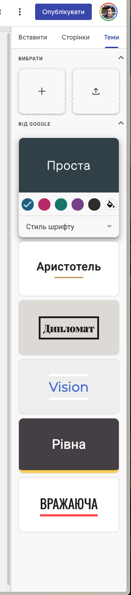
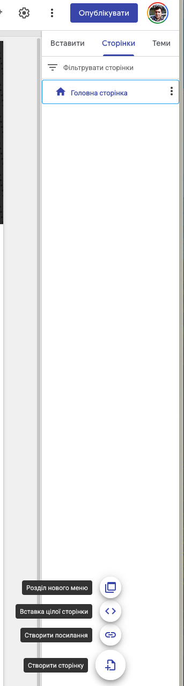

# 🤖 Автоматизовані засоби створення та публікації вебресурсів

## 🏫 Урок **41**

---

## 📝 Завдання

Створіть сайт про дивовижні споруди світу, який складатиметься з двох сторінок:

1. **Головна сторінка** — короткий опис сайту та зображення, що ілюструє дивовижні споруди світу
2. **Сторінка "Варто побачити"** — детальний опис однієї зі споруд з фото та текстом

Використайте сервіс Google Сайти для створення та публікації вашого вебсайту.

---

## 📹 Відео інструкція

[YouTube-Інструкція](https://youtu.be/NMhCdsCOipM)

---

## Інструкції (Створюємо порожній сайт)

1. Відкрийте сервіс [Сайти Google](https://sites.google.com/)
2. Створіть сайт використовуючи шаблон "Порожній сайт"

---

## Інструкції (Створюємо назву сайту)

3. Введіть назву вебсайту (відповідно до зразка)

---

## Інструкції (Застосовуємо тему)

  

4. У правій частині сторінки оберіть вкладку "Теми"
5. Оберіть одну з готових тем оформлення для сайту
6. Налаштуйте колір і стиль шрифту для обраної теми

  

  

  

---

## Інструкції (Додаємо нову сторінку сайту)

  

7. У правій частині сторінки оберіть вкладку "Сторінки"
8. Натисніть кнопку ➕ та оберіть "Створити сторінку", щоб додати нову сторінку з описом дивовижної споруди
9. Вкажіть назву сторінки "Варто побачити"

  

  

  

---

## Інструкції (Вивчаємо приклад)

  

10. Перейдіть на [сайт-зразок](https://sites.google.com/view/7classnush/%D0%B3%D0%BE%D0%BB%D0%BE%D0%B2%D0%BD%D0%B0-%D1%81%D1%82%D0%BE%D1%80%D1%96%D0%BD%D0%BA%D0%B0?authuser=0), або скористайтеся QR-кодом праворуч
11. Уважно вивчіть матеріали сайту та скористайтеся ними як зразком для заповнення сторінок свого сайту

  

  

  

---

## Інструкції (Додаємо контент)

  

12. Перейдіть на вкладку "Сторінки" та оберіть сторінку "Варто побачити"
13. Перейдіть на вкладку "Вставити" та в розділі "Блоки контенту" оберіть блок з фото ліворуч та текстом праворуч
14. Заповніть блок відповідно до зразка (текст можна взяти з [Вікіпедії](https://uk.wikipedia.org/wiki/%D0%9B%D1%8C%D0%B2%D1%96%D0%B2%D1%81%D1%8C%D0%BA%D0%B8%D0%B9_%D0%BD%D0%B0%D1%86%D1%96%D0%BE%D0%BD%D0%B0%D0%BB%D1%8C%D0%BD%D0%B8%D0%B9_%D0%B0%D0%BA%D0%B0%D0%B4%D0%B5%D0%BC%D1%96%D1%87%D0%BD%D0%B8%D0%B9_%D1%82%D0%B5%D0%B0%D1%82%D1%80_%D0%BE%D0%BF%D0%B5%D1%80%D0%B8_%D1%82%D0%B0_%D0%B1%D0%B0%D0%BB%D0%B5%D1%82%D1%83_%D1%96%D0%BC%D0%B5%D0%BD%D1%96_%D0%A1%D0%BE%D0%BB%D0%BE%D0%BC%D1%96%D1%97_%D0%9A%D1%80%D1%83%D1%88%D0%B5%D0%BB%D1%8C%D0%BD%D0%B8%D1%86%D1%8C%D0%BA%D0%BE%D1%97))
15. Щоб додати фото, натисніть ➕ та оберіть "Вибрати зображення", потім оберіть "Google Зображення" та скористайтеся пошуком, щоб знайти і додати потрібне зображення

  

  

  

---

## Інструкції (Публікуємо сайт)

  

16. Натисніть кнопку "Опублікувати" у верхньому правому куті
17. Вкажіть адресу сайту у форматі: **ПРІЗВИЩЕ-lviv-opera-theatre** (наприклад: shevchenko-lviv-opera-theatre)
18. Натисніть кнопку "Опублікувати" в діалоговому вікні
19. Скопіюйте посилання на сайт, відкрийте його в новому вікні браузера та покажіть вчителю

  

  

  

