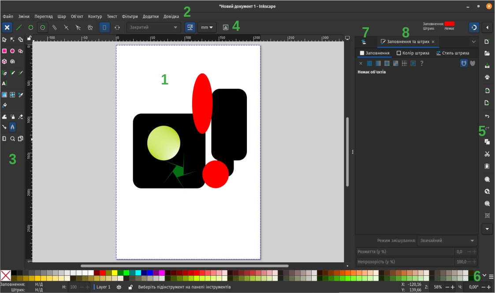

# Графічний векторний редактор Inkscape. Інструменти Inksape.

### Урок 44

---

## Що таке графічний векторний редактор?

Графічний векторний редактор – це програма для створення та редагування зображень, які складаються з ліній, кривих і фігур, що зберігаються у вигляді математичних об'єктів, а не пікселів.

---

## Переваги та недоліки векторного формату

| Порівняння       | Векторні редактори               | Растрові редактори             |
|------------------|--------------------------------|--------------------------------|
| **Якість**       | Не втрачають якість при збільшенні | Пікселі розмиваються при збільшенні |
| **Розмір файлу** | Зазвичай менший                 | Часто більший                  |
| **Редагування**  | Легко змінювати форму і розмір об'єктів | Важко змінювати окремі елементи |
| **Деталізація**  | Менше деталей, підходять для схем і логотипів | Більше деталей, добре для фото |
| **Приклад програм** | Adobe Illustrator, Inkscape  | Photoshop, GIMP |

---

## Вікно редактора Inkscape

  

    <ol>
      <li>Полотно</li>
      <li>Панель меню</li>
      <li>Панель інструментів</li>
      <li>Панель параментрів інструментів</li>
      <li>Панель команд</li>
      <li>Палітра кольорів</li>
      <li>Інструменти шарів</li>
      <li>Інструменти заповнення</li>
    </ol>
  

  

    
  

