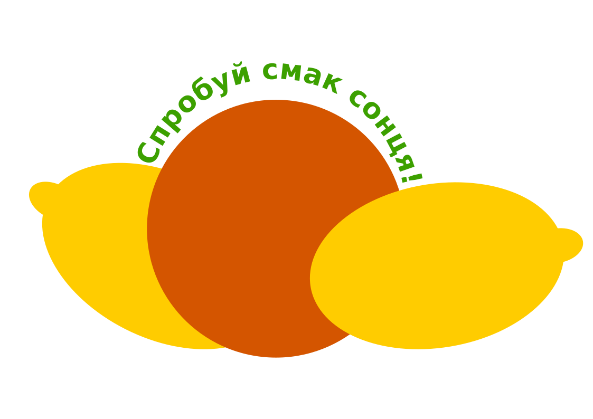

# Додавання тексту до графіки в Inkscape

### Урок 47

---

## Як додати текст до зображення в Inkscape?

[Додаємо текст до до зображення](https://www.youtube.com/watch?v=6jLtjLWjeKE) в Inkscape

---

## 💎 Завдання на уроці 💎

    

      Створіть зображення логотипа, що складається, з фігур різної форми, які розміщені в різних шарах.
      Додайие текстовий напис, та розташуйте його вздовж контуру фігури.
      <ol>
        <li>Створіть новий документ Inkscape. Збередіть його під іменем <code><ВАШЕ ІМʼЯ>-<Логотип></code> в папці <code>Документи</code></li>
        <li>Намалюйте круг, та залийте його кольором, як показщано на зразку</li>
        <li>Додайте новий шар, та намалюйте в ньому листок, у лівій частині як показано на зразку</li>
        <li>Скопіюйте листок, вставте його, та відобразіть зліва направо, як показано на зразку</li>
        <li>Поверніться до першого шару зображення, та додайте текстовий напис <code>Спробуй смак сонця!</code></li>
        <li>Налаштуйте розмір, шрифт та колір літер, щоб вони були схожі на зразок</li>
        <li>Виділіть напис та круг мишою, утримуючи натисненою клавішу <code>Shift</code></li>
        <li>Розмістіть текст по контуру використовуючи меню <code>Текст > Розмістити по контуру</code></li>
      </ol>
    

  

    
  

---

## Домашнє завдання

* Прочитати параграф 24: с. 184 - 189
* Переглянути [відео](https://www.youtube.com/watch?v=TiS9YlfBjM8) про стоворення складного малюнку "Сова"
* Повторити Квест 21-23 (с. 164 - 183)
