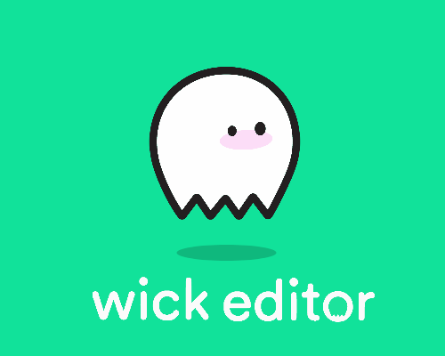
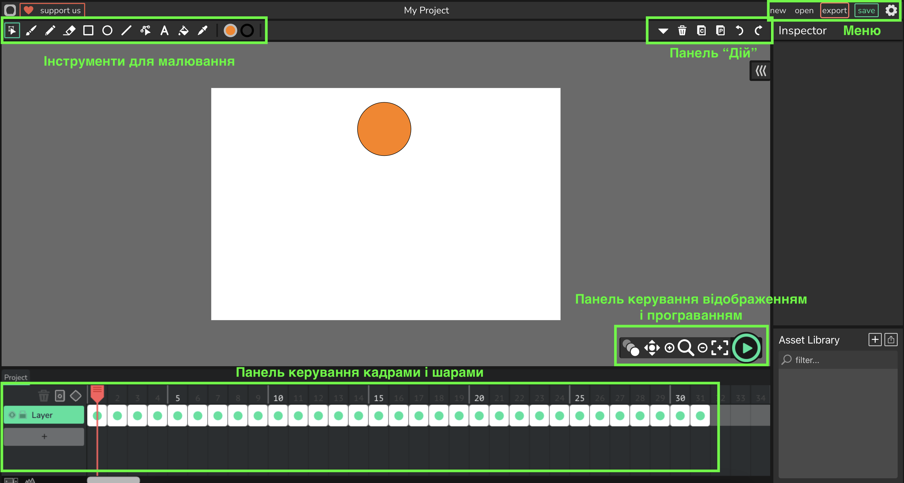
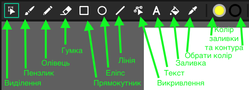

# 🎨 Анімація. Редактори анімації.

## ✨ Урок 49

---

## 🎯 Сьогодні ми дізнаємося

- ℹ️ **Що таке анімація** 🎞️
- 🔧 **Приклади анімації в повсякденному житті** 🏙️
- ✏️ **Редактори для створення анімації** 💻

---

## 🎨 Що таке анімація?

**📌 Анімація** – це створення **ілюзії руху** шляхом швидкої зміни зображень.

📽️ Використовується в:
✅ Мультфільмах 🎬
✅ Відеоіграх 🎮
✅ Додатках 📱
✅ Рекламі 📢

---

## 📱 Приклади анімації з повсякденного життя

1️⃣ 👾 **GIF-анімації** у повідомленнях
2️⃣ 📈 **Рухомі банери** в інтернеті
3️⃣ 🎥 **Спецефекти** у фільмах
4️⃣ 👽 **Анімовані емодзі**
5️⃣ 📚 **Навчальні мультфільми**
6️⃣ 🎮 **Анімація в іграх**

---

## ⏩ Що таке FPS і чому це важливо?

- **⏳ FPS (Frames Per Second)** – це кількість кадрів, які відображаються за секунду.
- Чим **🔼 вищий FPS**, тим **🟢 плавніша** анімація, але потрібно більше ресурсів.
- **🔽 Низький FPS** робить рухи **🔴 ривчастими**.

---

## 🎯 Яке значення FPS вибрати?

- 🌐 **Для інтернет-анімацій**: **12-30 FPS** – оптимально для веб-контенту.
- 🎮 **Для відеоігор**: **30-60 FPS**, у кіберспорті – **120+ FPS** для ідеальної плавності.

---

## 📂 Основні формати збереження анімації

- 🎞️ **GIF** – короткі анімації з обмеженою палітрою кольорів.
- 📹 **MP4** – якісне відео, сумісне з більшістю пристроїв.
- 🌍 **WebM** – оптимізований для веб-сторінок, добре стискається.

✅ **GIF** – для мемів і простих анімацій.
✅ **MP4/WebM** – для довших і якісних відео.

---

## 🛠️ Редактор Wick

  

  

  

🔗 [**Wick Editor**](https://www.wickeditor.com/editor/)

  

---

## 🖥️ Інтерфейс редактора Wick

---

## 🎨 Інструменти для малювання Wick

🖌️ **Пензель** – для малювання вручну
📏 **Лінійка** – для рівних ліній
🟢 **Фігури** – кола, квадрати
🔤 **Текст** – додавання написів

---

## 🎯 Завдання на уроці

🎬 **Створити анімацію стрибаючого мʼяча** у редакторі Wick

📌 **Налаштування:**
✅ FPS: **12-15**
✅ Кількість кадрів: **не менше 15**
