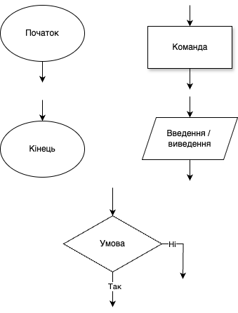
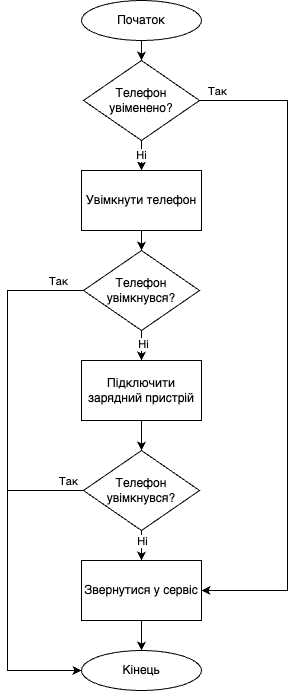
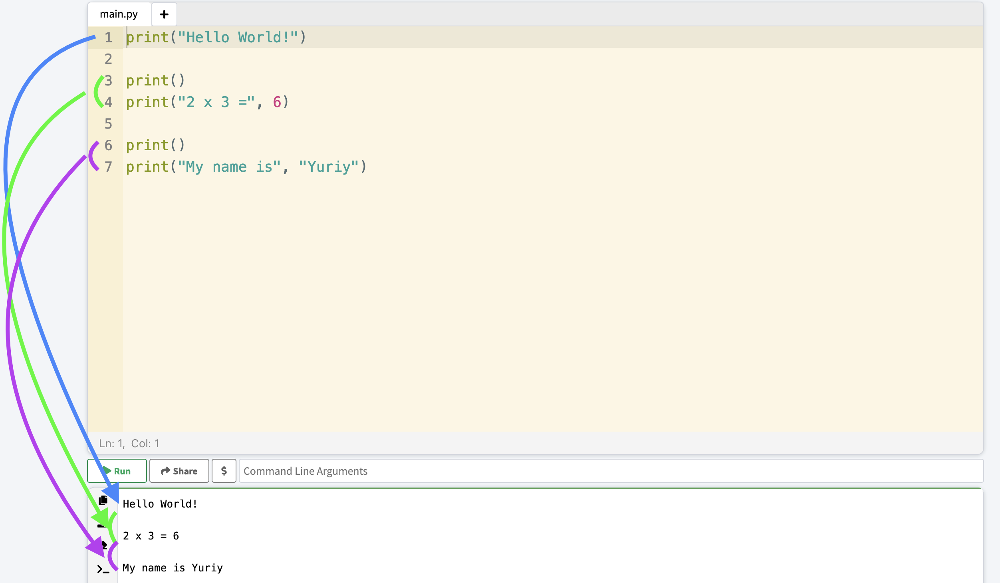

# 🧠 Мова та середовище програмування

## Урок 53

---

## 🎯 Сьогодні ми дізнаємося

- 💬 Що таке **мова програмування**
- 🖥️ Що таке **середовище програмування**
- 🌐 Популярні мови програмування
- 🔁 Що таке **ввід та вивід даних**

---

## 📊 Алгоритми та їх подання

<style>
.grid-container {
  display: grid;
  grid-template-columns: 50% 50%;
  align-items: left;
}
.col {
  font-size: 14px;
  padding: 10px;
  max-width: 100%;
  height: auto;
  text-align: center;
}
</style>

<div class="grid-container">
  <div class="col">

### 🔷 Позначки блок-схеми



  </div>

  <div class="col">

### 🔧 Алгоритм ремонту телефону



  </div>
</div>

---

## 🧾 Що таке мова програмування?

**Мова програмування** — це спеціальна мова, за допомогою якої людина може описати алгоритм компʼютеру, щоб той міг його зрозуміти і виконати.

🗣️ Як інструкція для робота!

---

## 🌟 Популярні мови програмування

<style>
section p, section ul {
  font-size: 20pt;
}
</style>

- 🐍 **Python** — проста та потужна. Ідеальна для початківців!
- 🌐 **JavaScript** — оживляє сайти, створює ігри
- 📱 **Java** — підходить для мобільних додатків
- 🚀 **Go (Golang)** — швидка і надійна, створена Google
- 🎮 **C++** — для ігор і потужних програм
- 🦀 **Rust** — нова мова для безпечного коду

---

## 🛠️ Де створюють програми?

- 🧪 [Thonny](https://thonny.org/) — середовище для Python
- 🌐 [Online-Python](https://www.online-python.com/) — прямо в браузері
- 📝 [VSCode](https://code.visualstudio.com/) — легкий і зручний редактор
- 🧠 [PyCharm](https://www.jetbrains.com/pycharm/) — для серйозних проєктів

---

## 🐍 Мова Python

<style>
  section p {
    font-size: 16pt;
  }
  .center-img {
    text-align: center;
    margin-bottom: 1em;
  }
</style>

<div class="center-img">
  
</div>

🔍 Назва **Python** не про змій, а про гумористичне шоу *Monty Python’s Flying Circus*!

👨‍💻 Автор — Ґвідо ван Россум. Він хотів дати мові цікаву, коротку назву.

🎭 Тому Python — це жартівлива назва, яка прижилася.

---

## 🖨️ Вивід даних у Python

- 🛠️ Для виводу даних використовують функцію `print()`
- 🗣️ Вона показує текст або числа на екрані

```python
print("Привіт")
print(42)
print("Результат:", 42)
```

- ✍️ Текст — у лапках
- 🔢 Числа — без лапок
- 🧩 Можна виводити кілька значень через кому

---

## ✨ "Hello World!" на Python



---

## 🏠 Домашнє завдання 1

🧠 Запитайте [ChatGPT](https://chatgpt.com/):
> *Чому сьогодні важливо вміти програмувати?*

💬 Розкажіть про відповідь на уроці!

---

## 🧩 Домашнє завдання 2

🖊️ Напишіть програму на Python, яка виводить такі малюнки:


💡 Використайте [Online-Python](https://www.online-python.com/) або [Thonny](https://thonny.org/),
запустіть програму, сфотографуйте результат і покажіть вчителю!
