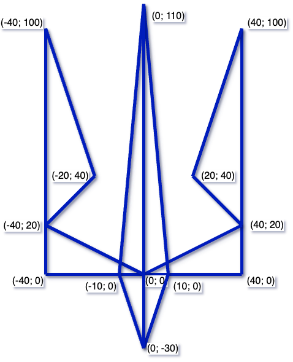

# 🐢 Створення графічних примітивів за допомогою Python

## 🏫 Урок **53**

---

## 🎯 Сьогодні ми дізнаємося

- 🐢 Що таке модуль `turtle` та для чого він потрібен.
- 🎨 Як керувати "черепашкою" для створення малюнків.
- 📐 Основні команди для малювання ліній та поворотів.
- 🔱 Створимо власний проєкт — Державний Герб України.

---

## 🧠 Пригадайте!

<div class="card">

Минулого уроку ми вивчили, що таке **модулі**.

- Якою командою підключити модуль? (`import`)
- Які модулі ми вже знаємо? (`math`, `random`, `string`)
- Чому зручно використовувати готові модулі?

</div>

---

## 🐢 Модуль `turtle` (Черепашка)

<div class="important-to-remember">

**Turtle** — це вбудований у Python модуль, який дозволяє створювати малюнки на екрані за допомогою віртуальної "черепашки" з олівцем.

</div>

Уявіть, що по аркушу паперу повзає маленька черепашка. Там, де вона проходить, залишається лінія певного кольору та товщини.

---

## 🛠️ Навігація черепашки

<div class="text-medium">

| Команда | Дія |
| :--- | :--- |
| `forward(n)` | Рухатися вперед на `n` пікселів |
| `backward(n)` | Рухатися назад на `n` пікселів |
| `left(angle)` | Повернути вліво на `angle` градусів |
| `right(angle)` | Повернути вправо на `angle` градусів |
| `penup()` | Підняти олівець (не малювати при русі) |
| `pendown()` | Опустити олівець (малювати) |

</div>

---

## 🎨 Налаштування вигляду

<div class="text-medium">

```python
import turtle

turtle.shape("turtle")   # Змінити вигляд на черепашку
turtle.color("blue")     # Змінити колір лінії
turtle.pensize(5)        # Змінити товщину лінії
turtle.speed(2)          # Швидкість руху (0-10; 0 = найшвидше, можна також слова)
```

**Координати:** Центр екрана має координати `(0, 0)`. Команда `goto(x, y)` миттєво переміщує черепашку в потрібну точку.

</div>

---

## 💻 Де писати код?

Використовуйте зручні онлайн-середовища:

👉 [**Python Sandbox (Turtle)**](https://pythonsandbox.com/turtle)
👉 [**Trinket Turtle**](https://trinket.io/turtle)

**Для перевірки:** зробіть скриншот екрана, де видно і ваш **код**, і отриманий **малюнок**.

---

## 🔱 Практичне завдання: Малюємо Тризуб

<div class="grid-container">
<div class="text-medium-small">

1. Відкрий [turtle sandbox](https://pythonsandbox.com/turtle)
2. Підключи модуль: `import turtle`
3. Встанови колір `"blue"` та товщину `5`.
4. Використовуючи команди `forward`, `left`, `right` та `goto`, намалюй Тризуб.
5. Координати основних точок дивись на схемі праворуч.

</div>
<div class="image-center">



</div>
</div>

---

## 💡 Поради для успіху

- Починай малювати з центральної частини або з основи.
- Використовуй `penup()` та `pendown()`, якщо потрібно перемістити черепашку без малювання лінії.
- Не бійся помилятися! Якщо лінія пішла не туди — просто зміни кут або відстань у коді.
- Спробуй зробити свій тризуб унікальним: зміни колір фону або додай жовту основу.
