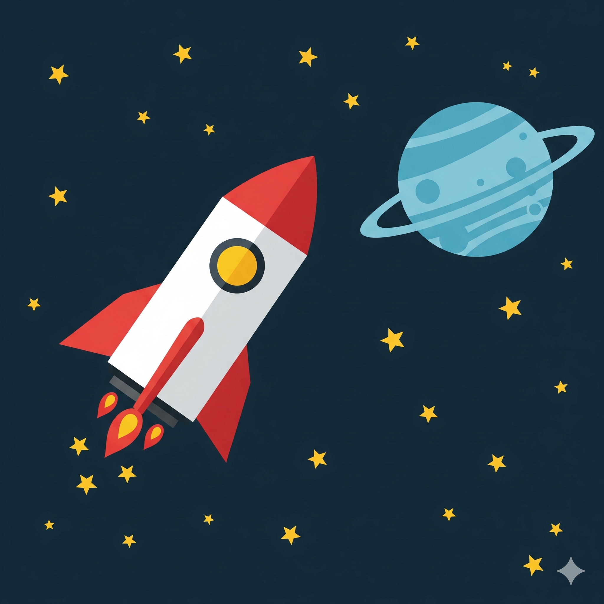

# Створення векторної композиції «Космічна подорож»

## 🏫 Урок **55**

---

## 🎯 Сьогодні ми навчимося

- 🎨 Створювати складні об'єкти з простих фігур.
- 🛠️ Працювати з логічними операціями над контурами.
- 🚀 Створювати власний проєкт «Космічна подорож» в Inkscape.

---

## 💡 Що таке Inkscape?

- **Inkscape** — це безкоштовний редактор векторної графіки з відкритим кодом.
- На відміну від растрових зображень (пікселів), векторні зображення можна масштабувати без втрати якості.

**Запам'ятайте:**

Векторна графіка ідеально підходить для логотипів, іконок та ілюстрацій.

---

## 🛠️ Логічні операції (Меню «Контур»)

Це "магія", яка дозволяє створювати нові форми:

1. **Сума** — об'єднує кілька фігур в одну.
2. **Різниця** — верхня фігура працює як "формочка для печива", вирізаючи шматок із нижньої.

---

## 🚀 Практичне завдання

**Ваша мета:** Відтворити космічну сцену за зразком.

---

## 📊 Рівні складності проєкту

### ⭐️ Достатній

- Створити основу ракети з прямокутника та трикутника.
- Налаштувати кольори.
- Використати шари.

### ⭐️⭐️ Середній

- Додати ілюмінатор та фон із зірками (інструмент «Зірки»).
- Намалювати одну зірку, потім скопіювати її кілька разів, змінюючи положення та розмір.

### ⭐️⭐️⭐️ Високий

- Створити вогонь та планету з кільцем (операція «Різниця»).
- Вирівняти всі елементи композиції.

