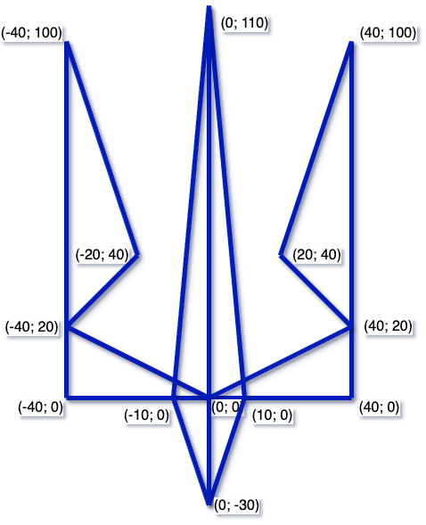

# **Малюємо Тризуб**

## Використовуючи Python модуль turtle

## Урок **58**

---

## Завдання

  

1. Відкрий [turtle sandbox](https://pythonsandbox.com/turtle)
2. Використай команди модуля `turtle`, щоб намалювати Тризуб *синім кольором*.
3. Дививсь координати основних точок на та приклад тризубу праворуч.
4. Основні команди, що можуть тобі знадобитися

   | Команда            | Що робить                                  |
   |--------------------|--------------------------------------------|
   | `forward(довжина)` | Рухається вперед на вказану відстань       |
   | `back(довжина)`    | Рухається назад                            |
   | `left(кут)`        | Повертає вліво на вказаний кут (градуси)   |
   | `right(кут)`       | Повертає вправо                            |
   | `penup()`          | Піднімає "олівець", не малює               |
   | `pendown()`        | Опускає "олівець", малює знову             |
   | `goto(x, y)`       | Рухається до вказаної точки                |
   | `color("blue")`    | Задає колір лінії                          |
   | `pensize(5)`       | Встановлює товщину лінії                   |

  

  

  

