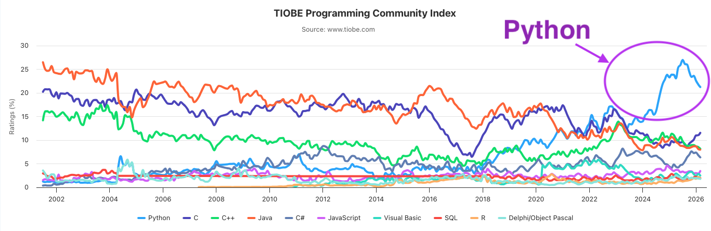

# 🐍 Величини. Змінні.
  Знайомство з Python

## 🏫 Урок **60**

---

## 🎯 Сьогодні ми дізнаємося

- 🐍 Що таке мова Python та хто її створив.
- 📦 Що таке змінні та як вони зберігають дані.
- 🔢 Які типи даних існують у програмуванні.
- 💻 Як написати свою першу програму "Hello World".

---

## 🐍 Що таке Python?

**Python (Пайтон)** — це сучасна мова програмування, створена **Гвідо ван Россумом** у 1991 році.

- Вона дуже популярна, бо її код легко читати.
- Вона схожа на звичайну англійську мову.
- Використовується всюди: від сайтів до штучного інтелекту.

---

## 🌟 Цікаві факти про Python

<div class="grid-container text-medium">
  <div class="grid-item">

**🎬 Кіно:** Використовувався для створення спецефектів у «Зоряних війнах» та мультфільмах Pixar.

  </div>
  <div class="grid-item">

**🚀 Космос:** NASA використовує Python для аналізу космічних даних.

  </div>
  <div class="grid-item">

**🤡 Назва:** Названа на честь комедійного шоу «Летючий цирк Монті Пайтона».

  </div>
</div>

---

## Популярність мови Python

<div class="image-center">



</div>

---

## 📦 Величини та змінні

<section class="text-medium-small">

Уявіть, що **змінна** — це коробка з наклейкою (іменем), у яку можна покласти якесь значення.

<div class="important-to-remember">

**Змінна** — це назване місце в пам’яті комп’ютера, де зберігається певне значення, яке може змінюватися.

</div>

- Кожна змінна має **ім'я** (наприклад, `score`).
- Кожна змінна має **значення** (наприклад, `10`).
- Щоб записати значення у змінну, використовуємо знак `=`.

```python
score = 10
student_name = "Марко"

print(score)         # 10
print(student_name)  # Марко
```

</section>

---

## 🔢 Основні типи даних

| Тип | Назва | Приклад |
| :--- | :--- | :--- |
| **int** | Цілі числа | `10`, `-5`, `1000` |
| **float** | Дробові числа | `3.14`, `0.5`, `-1.2` |
| **str** | Рядок (текст) | `"Привіт"`, `"7 клас"` |
| **bool** | Логічний тип | `True` (так), `False` (ні) |

---

## 🧩 Як працюють `print()` та `type()`

<div class="grid-container text-left text-medium-small">
  <div class="grid-item">

### 🖨️ `print()`

- Показує текст або значення на екрані.
- Допомагає перевірити, що зараз у змінній.
- Може надрукувати кілька значень одразу через кому.

```python
name = "Оля"
age = 12

print(name)
print("Мене звати", name, "і мені", age, "років")
```

  </div>
  <div class="grid-item">

### 🔍 `type()`

- Показує, якого типу дані у змінній.
- Допомагає відрізнити текст, число або логічне значення.

```python
age = 12
print(type(age))   # <class 'int'>
```

  </div>
</div>

---

## 💻 Практична частина

<div class="task">

**Завдання 1: Hello World**

Введіть у редакторі коду наступні команди та запустіть їх:

</div>

```python
print("Hello, World!")
print("Я починаю вивчати Python!")
```

---

## 💻 Досліджуємо типи даних

<div class="task">

**Завдання 2: Функція type()**

Скопіюйте цей код та подивіться, що виведе програма:

</div>

```python
x = 100
message = "Урок інформатики"
is_active = True

print(x, type(x))
print(message, type(message))
print(is_active, type(is_active))
```

---

## 💻 Власна анкета

<div class="task">

**Завдання 3: Твоя програма**

Створи 4 змінні:

1. `my_name` (твоє ім'я)
2. `my_age` (вік)
3. `my_height` (зріст, наприклад 1.6)
4. `is_ready = True`

Виведи їх на екран за допомогою команди `print`.

</div>
