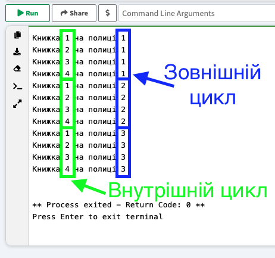

# **Вкладені цикли**

## Урок **64**

---

## 🎯 Сьогодні ми дізнаємося

- ℹ️ Що таке вкладені цикли.
- 🔧 Побачимо практичне застосування вкладених циклів
- ✏️ Виконаємо практичну роботу

---

## Що таке вкладені цикли 🤨

**Вкладений цикл** — це цикл, розміщений у тілі іншого циклу, тобто один цикл виконується всередині іншого.
Внутрішній цикл повторюється повністю на кожній ітерації зовнішнього циклу.

---

## 📌 Приклад вкладеного циклу

- У класі є 3 парти (зовнішній цикл)
- За кожною партою 2 учні (внутрішній цикл).

Для кожної парти ми переглядаємо ДЗ в обох учнів

---

## Приклад вкладених циклів Python

<style>
.grid-container {
  display: grid;
  grid-template-columns: 50% 50%;
  align-items: left;
}
.panel {
  padding: 20px;
  font-size: 30px;
}
</style>

<div class="grid-container">
<div>

```python
for shelf in range(1, 4):
    for book in range(1, 5):
        print("Книжка", book, "на полиці", shelf)
```

</div>
<div>



</div>
</div>

---

## Практичне завдання [Python Online](https://www.onlineide.pro/playground/python)

<div class="grid-container">
<div class="panel">

### Варіант 1️⃣

Використай два вкладені цикли `while`, щоб надрукувати таблицю моноження для 2, 3, 4, 5


```python
x = 2
y = 1
while x...:
    while y <= 9:
        print(...)
        y += 1
```

</div>
<div class="panel">

### Варіант 2️⃣

Використай два вкладені цикли `for`, щоб надрукувати таблицю моноження для 6, 7, 8, 9

```python
for x in ....:
    for y in ...:
        print(...)
```

</div>
</div>
