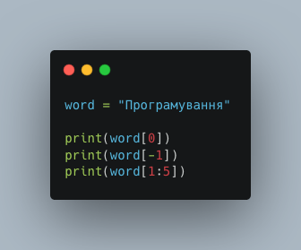
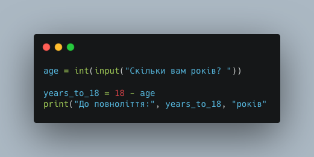
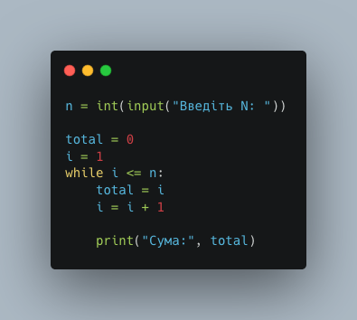

# Діагностувальна робота: Програмування

**Клас:** 7 | **Дата:** ___________
**На основі уроків:** 50–60
**Групи результатів навчання:** 1, 2, 3, 4

*Максимальний бал: 48*

## Група 1: Працює з інформацією, даними, моделями

### Рівень: Простий

**1.** Який тип даних Python використовується для збереження текстової інформації?

- А) `int`
- Б) `bool`
- В) `str`
- Г) `float`

**2.** Що виведе команда `print(15 % 4)`?

- А) 3.75
- Б) 4
- В) 3
- Г) 1

### Рівень: Середній

**3.** Дано рядок `word = "Програмування"`. Зіставте вираз Python із його результатом (3 пари — 3 бали).

| Вираз Python | Результат |
|---|---|
| `word[0]` | `"я"` |
| `word[-1]` | `"рогр"` |
| `word[1:5]` | `"П"` |

**4.** Зіставте вираз Python із його результатом (4 пари — 4 бали):

| Вираз Python | Результат |
|---|---|
| `10 % 3` | `True` |
| `2 ** 3` | `1` |
| `bool("")` | `8` |
| `bool(42)` | `False` |

### Рівень: Складний

**5.** Напиши програму-калькулятор площі трикутника за формулою S = 0.5 × основа × висота (3 бали).

Програма повинна:

1. Зчитати основу та висоту через `input()`, перетворивши на дійсне число.
2. Обчислити площу за формулою.
3. Вивести результат у форматі: `Площа трикутника = X`.

*Місце для відповіді:*

_______________________________________________

_______________________________________________

_______________________________________________

_______________________________________________

_______________________________________________

## Група 2: Створює інформаційні продукти

### Рівень: Простий

**6.** Яка команда Python дозволяє отримати текстові дані від користувача з клавіатури?

- А) `print()`
- Б) `input()`
- В) `type()`
- Г) `import()`

**7.** Яку команду треба написати першим рядком програми, щоб мати можливість використовувати функцію `math.sqrt()`?

- А) `use math`
- Б) `include math`
- В) `import math`
- Г) `add math`

### Рівень: Середній

**8.** Зіставте блок коду програми-вгадайки з його призначенням (4 пари — 4 бали):

| Блок коду | Призначення |
|---|---|
| `import random` | Зчитує відповідь гравця та перетворює на ціле число |
| `random.randint(1, 10)` | Підключає модуль для роботи з випадковими числами |
| `int(input(...))` | Перевіряє, чи відповідь гравця збігається із загаданим |
| `if guess == secret:` | Генерує випадкове ціле число від 1 до 10 |

**9.** Зіставте елемент програми перевірки пароля з його роллю (3 пари — 3 бали):

| Елемент програми | Роль |
|---|---|
| `while attempts > 0:` | Перевіряє, чи введений пароль збігається з правильним |
| `if entered == password:` | Зменшує кількість залишених спроб |
| `attempts = attempts - 1` | Повторює введення, поки залишаються спроби |

### Рівень: Складний

**10.** Програма виводить таблицю множення числа, введеного користувачем (3 бали).

Дай відповідь на три запитання:

1. Які перші три рядки виведе програма, якщо користувач ввів число **3**?
2. Що означає `range(1, 11)` у контексті цієї програми?
3. Яку роль виконує вираз `n * i`?

*Місце для відповіді:*

_______________________________________________

_______________________________________________

_______________________________________________

_______________________________________________

_______________________________________________

## Група 3: Працює в цифровому середовищі

### Рівень: Простий

**11.** Яка помилка виникне, якщо в коді Python пропустити двокрапку після умови оператора `if`?

- А) `NameError`
- Б) `TypeError`
- В) `SyntaxError`
- Г) `IndexError`

**12.** У середовищі Thonny для запуску програми крок за кроком у режимі налагодження потрібно натиснути:

- А) F5
- Б) Ctrl+F5
- В) F6
- Г) F8

### Рівень: Середній

**13.** Розглянь програму *(див. зображення нижче)*. Зіставте кожен рядок програми з тим, що він робить (3 пари — 3 бали).

| Рядок програми | Що він робить |
|---|---|
| `age = int(input("Скільки вам років? "))` | Обчислює кількість років до повноліття |
| `years_to_18 = 18 - age` | Виводить результат на екран |
| `print("До повноліття:", years_to_18, "років")` | Зчитує вік користувача та перетворює на ціле число |

**14.** Зіставте тип помилки Python з її описом (4 пари — 4 бали):

| Тип помилки | Опис |
|---|---|
| `SyntaxError` | Звернення до символу рядка за неіснуючим індексом |
| `NameError` | Спроба виконати операцію з несумісними типами даних |
| `TypeError` | Звернення до змінної, яку не було оголошено |
| `IndexError` | Пропущена двокрапка або дужка в коді |

### Рівень: Складний

**15.** У програмі підрахунку суми чисел від 1 до N є логічна помилка *(див. зображення нижче)*. Дай відповідь на три запитання (3 бали).

1. Яке значення матиме змінна `total` після виконання програми для N = 4?
2. Яку одну зміну потрібно внести у рядок `total = i`, щоб програма рахувала правильно?
3. Яке правильне значення суми чисел від 1 до 4?

*Місце для відповіді:*

_______________________________________________

_______________________________________________

_______________________________________________

## Група 4: Безпечно та відповідально використовує інформаційні технології

### Рівень: Простий

**16.** Який із паролів є найнадійнішим?

- А) `qwerty`
- Б) `12345678`
- В) `Tr@9xK2a1b42!`
- Г) `password`

**17.** Який атрибут модуля `string` містить лише цифри від 0 до 9?

- А) `string.ascii_letters`
- Б) `string.digits`
- В) `string.punctuation`
- Г) `string.pictures`

### Рівень: Середній

**18.** Зіставте пароль з оцінкою його надійності (4 пари — 4 бали):

| Пароль | Оцінка надійності |
|---|---|
| `abc` | Надійний — довгий, містить літери, цифри та спецсимволи |
| `Zx7!qM2@kL9#` | Прийнятний — достатня довжина, але немає спецсимволів |
| `12345678` | Дуже слабкий — занадто короткий |
| `PythonCode2024` | Слабкий — очевидна послідовність цифр |

**19.** Зіставте умову програми перевірки надійності пароля з реакцією програми (3 пари — 3 бали):

| Умова | Реакція програми |
|---|---|
| `length >= 8` | `"Пароль занадто короткий ❌"` |
| `length >= 6` (elif) | `"Пароль надійний ✅"` |
| Жодна умова не спрацювала | `"Пароль прийнятний, але краще зробити довше"` |

### Рівень: Складний

**20.** Самостійно напиши програму-генератор надійного пароля (3 бали).

Програма повинна:

1. Імпортувати модулі `random` та `string`.
2. Створити рядок `chars` із усіх латинських літер та цифр: `string.ascii_letters + string.digits`.
3. За допомогою циклу `for` та `range(8)` побудувати пароль із 8 випадкових символів (на кожній ітерації додавати один символ до змінної `password`).
4. Вивести результат у форматі: `Ваш пароль: <згенерований_пароль>`.

*Місце для відповіді:*

_______________________________________________

_______________________________________________

_______________________________________________

_______________________________________________

_______________________________________________
