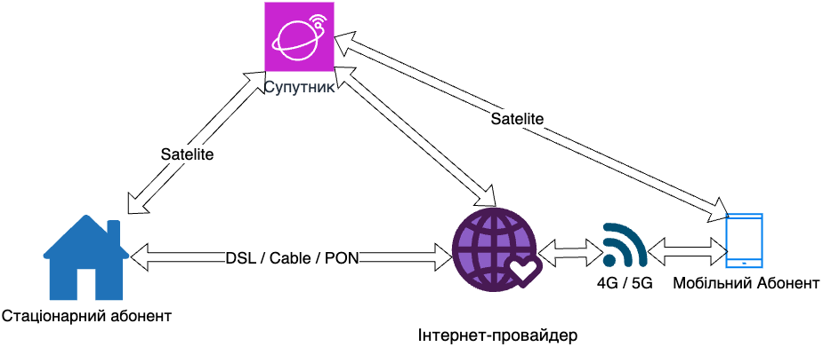

# 🌐✨ Використовуємо інтернет

## 🏫📘 Урок **03**

---

## 🎯 Сьогодні ми дізнаємося

- 🌐 Як підключитися до інтернету
- 🛠️ Хто керує інтернетом
- 🤔 Цікаві факти та міфи

---

## 🔌 Як підключитися до інтернету?

  

Інтернет-провайдер (Internet Service Provider, ISP) забезпечує доступ до мережі «Інтернет» та пов’язаних з нею послуг.

- ☎️ DSL: підключення через телефонну лінію
- 📺 Cable: підключення через кабельну мережу
- 🧵 PON: підключення через оптоволоконний кабель
- 🛰️ Супутник: підключення через супутниковий сигнал
- 📱 Мобільна мережа: підключення через 4G/5G мережу

  

  

  

---

## 🏢 Хто керує інтернетом?

- 🌐 **ICANN** (Internet Corporation for Assigned Names and Numbers) — відповідає за управління доменними іменами та IP-адресами.
- 🧑‍🔬 **IETF** (Internet Engineering Task Force) — розробляє та підтримує стандарти інтернету, такі як TCP/IP.
- 🕸️ **W3C** (World Wide Web Consortium) — розробляє стандарти для Всесвітньої павутини (WWW), включаючи HTML та CSS.
- 🌍 **ISOC** (Internet Society) — підтримує та просуває розвиток інтернету для всіх людей у світі.

---

## 🏆 Цікаві факти про організації, що керують інтернетом

- 🌐 **ICANN** була заснована у 1998 році, її штаб-квартира знаходиться в Лос-Анджелесі, США.
- 🧑‍🔬 **IETF** — це відкрита група, до якої може приєднатися будь-хто, хто цікавиться розвитком інтернету.
- 🕸️ **W3C** створив сер Тім Бернерс-Лі — винахідник Всесвітньої павутини.
- 🌍 **ISOC** підтримує освітні програми та проєкти для розвитку інтернету у всьому світі.

---

## 🌟 Цікаві факти про інтернет

- 🌍 Понад 5 мільярдів людей у світі користуються інтернетом.
- 🔎 Щосекунди в Google виконується понад 100 000 пошукових запитів.
- 📷 Щодня в Instagram завантажують понад 95 мільйонів фотографій.
- 📨 Перший електронний лист був надісланий у 1971 році.
- 🏛️ Перший веб-сайт був створений у 1991 році і досі існує: [info.cern.ch](http://info.cern.ch).
- 🚀 Найшвидший інтернет у світі — понад 3000 Гбіт/с (Японія, 2022).
- 🦠 Під час пандемії COVID-19 трафік в інтернеті зріс на 40%.

---

## 🧩 Поширені міфи про інтернет

- 🕵️‍♂️ **Весь інтернет анонімний** — Насправді більшість дій у мережі можна відстежити.
- 🗑️ **Можна повністю видалити інформацію з інтернету** — Деякі дані залишаються на серверах або в архівах.
- 🌐 **Інтернет належить одній компанії чи країні** — Інтернет є глобальною мережею, яку підтримують тисячі організацій.
- 🚫 **Весь контент в інтернеті безпечний** — Насправді існує багато шахрайських сайтів і небезпечного контенту.

---

## 📝 Завдання

🔍 Знайдіть відомості про те, як працює супутниковий інтернет. Сформулюйте своє пояснення, чому вартість цього способу з’єднання є високою.
