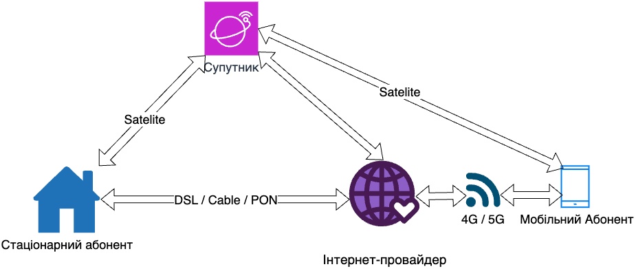

# 🌐✨ Використовуємо інтернет

## 🏫 Урок **03**

---

## 🛡️ Пригадуємо: техніка безпеки

- 🖥️ Сідаємо рівно, відстань до екрана — довжина витягнутої руки.
- 🚫 Без їжі, напоїв та верхнього одягу в кабінеті інформатики.
- 🔌 Не чіпаємо кабелі, роз'єми, задню панель монітора чи системного блока.
- ⚡ Не вмикаємо/вимикаємо комп'ютер самостійно, не відкриваємо системний блок.
- 🔥 Побачили дим, почули незвичний звук або сталася помилка — одразу повідомляємо вчителя.

---

## 🎯 Сьогодні ми дізнаємося

- 🌐 Хто керує інтернетом і чому в нього немає єдиного власника
- 🔌 Як підключитися до інтернету
- 🕰️ Досліджуємо перший вебсайт в історії людства

---

## ⚡ Бліц-опитування

<section class="text-medium">

1. Що перетворює доменне ім'я сайту на IP-адресу?
2. Наведіть приклад домену верхнього рівня.
3. Яку відповідальність може нести людина за порушення законів у цифровій сфері?
4. А хто, на вашу думку, встановлює правила для доменних імен та адрес в інтернеті?

</section>

---

## 🤔 А хто насправді керує інтернетом?

Часто можна почути: **«Інтернетом керує одна велика компанія (або одна країна), яка може будь-що вимкнути чи заборонити»**.

> ❓ Чи згодні ви з цим твердженням? Хто, на вашу думку, насправді відповідає за роботу інтернету?

Насправді інтернет **не має єдиного власника** — він децентралізований і складається з мереж, що належать тисячам організацій, компаній і людей у всьому світі. 🌍

---

## 🔌 Як підключитися до інтернету?

  

**Інтернет-провайдер** (Internet Service Provider, ISP) забезпечує доступ до мережі «Інтернет» та пов'язаних з нею послуг.

- ☎️ DSL: підключення через телефонну лінію
- 📺 Cable: підключення через кабельну мережу
- 🧵 PON: підключення через оптоволоконний кабель
- 🛰️ Супутник: підключення через супутниковий сигнал
- 📱 Мобільна мережа: підключення через 4G/5G мережу

  

  

  

---

## 🏢 Хто керує інтернетом?

🌐 <b>ICANN</b> управління доменними іменами та IP-адресами

🧑‍🔬 <b>IETF</b> стандарти інтернету, як-от TCP/IP

🕸️ <b>W3C</b> стандарти Всесвітньої павутини — HTML, CSS

🌍 <b>ISOC</b> підтримка розвитку інтернету для всіх людей у світі

---

## 🏆 Цікаві факти про організації

<section class="text-medium">

- 🌐 **ICANN** заснована у 1998 році, штаб-квартира — у Лос-Анджелесі, США.
- 🧑‍🔬 **IETF** — відкрита група, до якої може приєднатися будь-хто.
- 🕸️ **W3C** створив сер Тім Бернерс-Лі — винахідник Всесвітньої павутини.
- 🌍 **ISOC** підтримує освітні програми з розвитку інтернету у світі.

</section>

---

## 🌟 Цікаві факти про інтернет

<section class="text-medium-small">

- 🌍 Понад 5 мільярдів людей у світі користуються інтернетом.
- 🔎 Щосекунди в Google виконується понад 100 000 пошукових запитів.
- 📨 Перший електронний лист був надісланий у 1971 році.
- 🏛️ Перший вебсайт було створено в 1991 році — і він **досі працює**: [info.cern.ch](http://info.cern.ch)
- 🚀 Найшвидший інтернет у світі — понад 3000 Гбіт/с (Японія, 2022).

</section>

---

## 🧠 Вікторина «Правда чи міф?» — Classtime

📱

---

## 🕹️ Квест: подорож у 1991 рік

<section class="task text-medium-small">

Відкрийте в парі сайт [info.cern.ch](http://info.cern.ch) — перший вебсайт в історії — і дайте відповіді:

1. Прочитайте текст на головній сторінці. Якою фразою він починається?
2. Відкрийте посилання **«Browse the first website»**. Яким заголовком (H1) підписана ця сторінка?
3. Знайдіть на ній посилання **«History»** і відкрийте його — це хронологія проєкту. Яку подію позначено датою **«March 1989»**? А що відбулося на **«Christmas 1990»**?
4. Порахуйте зображення, кольори та кнопки на сторінці «The World Wide Web project». Порівняйте з головною сторінкою будь-якого сучасного сайту.
5. Поверніться на info.cern.ch і спробуйте посилання **«Browse the first website using the line-mode browser simulator»**. Одним реченням опишіть, чим цей спосіб перегляду відрізняється від сучасного браузера.

</section>

---

## 🏠 Домашнє завдання

<section class="text-medium-small">

1. 📖 Опрацювати підручник, с. 12–14 (Крок 1–2; Крок 3 переглянути ознайомчо)
2. 🖥️ Переглянути презентацію уроку

</section>
