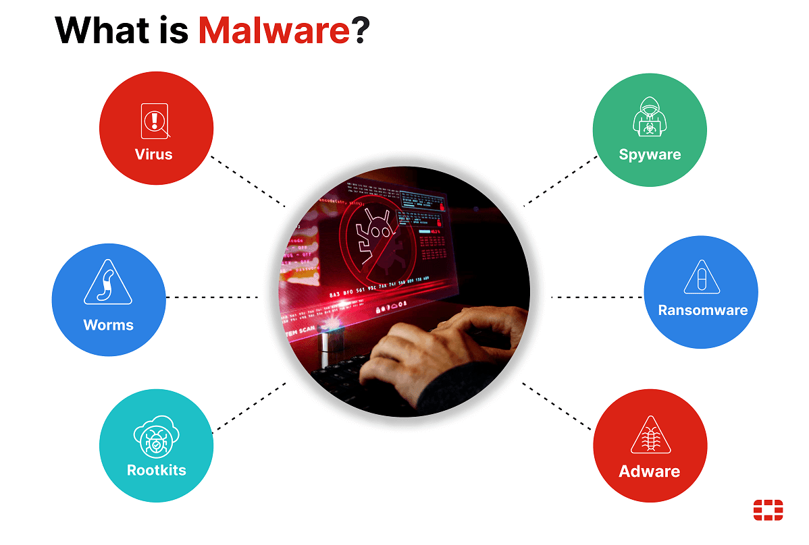

# **Шкідливі програми, їх типи, принципи дії і боротьба з ними**

## Урок 10

---

## 🎯 Сьогодні ми дізнаємося

- ℹ️ Що таке шкідливе програмне забезпечення (ШПЗ)
- 🧪 Які існують типи шкідливих програм.
- 💡 Як вони працюють.
- 🛡️ Як захистити свій комп'ютер від них.

---

## Що таке Шкідливе програмне забезпечення (Malware)?

**Шкідливе ПЗ (англ. Malware)** - це програми, створені з метою нанесення шкоди комп'ютеру, даним або отримання несанкціонованого доступу.

---

## 🚨 Як шкідливе ПЗ потрапляє на комп'ютер, телефон чи планшет?

- 📥 Завантаження заражених файлів з інтернету (програми, ігри, документи).
- 📧 Відкриття шкідливих вкладень у листах або повідомленнях.
- 🌐 Перехід за підозрілими посиланнями на сайтах чи у соцмережах.
- 💾 Використання заражених флешок, карт пам'яті або інших носіїв.
- 📲 Встановлення додатків з неперевірених джерел (не з офіційних магазинів).
- ⚠️ Відсутність оновлень системи та антивірусного захисту.

---

## Основні типи ШПЗ

- **Комп'ютерні віруси:** Самостійно розмножуються, вбудовуючись в інші програми.
- **Троянські програми (трояни):** Маскуються під корисні програми, але виконують шкідливі дії.
- **Шпигунське ПЗ (Spyware):** Збирає інформацію про користувача без його відома.
- **Рекламне ПЗ (Adware):** Автоматично відображає небажану рекламу.
- **Вимагачі (Ransomware):** Шифрують файли або блокують доступ до комп'ютера, вимагаючи викуп.
- **Хробаки (Worms):** Самостійно розповсюджуються по мережі, інфікуючи інші комп'ютери.
- **Руткіти (Rootkits):** Приховують свою присутність та діяльність зловмисника в системі.

---

## 💻 Комп'ютерні віруси (Virus)

- **Визначення:** Програма, що може самостійно розмножуватися, вбудовуючись в інші програми чи файли.
- **Принципи дії:**
  - Пошкодження або видалення файлів.
  - Уповільнення роботи системи.
- **Приклади:** ILOVEYOU, Melissa.

---

## 🐎 Троянські програми (Trojan)

- **Визначення:** Маскуються під корисні програми (наприклад, гру або програму для чищення комп’ютера).
- **Принципи дії:**
  - Крадіжка паролів.
  - Відкриття несанкціонованого доступу до комп'ютера.
- **Приклади:** Zeus, Emotet, SpyEye.

---

## 🕵️ Шпигунське ПЗ (Spyware)

- **Визначення:** Програма, що таємно збирає інформацію про користувача без його відома.
- **Принципи дії:**
  - Відстежує натискання клавіш (кейлогер).
  - Записує історію відвідування сайтів.
  - Робить скріншоти екрана.
- **Приклади:** CoolWebSearch, FinFisher, DarkComet.

---

## 💰 Вимагачі (Ransomware)

- **Визначення:** Блокує доступ до комп'ютера або шифрує файли, вимагаючи викуп за відновлення доступу.
- **Принципи дії:**
  - Шифрує ваші документи, фото, відео, роблячи їх недоступними.
  - Відображає повідомлення з вимогою викупу (зазвичай у криптовалюті).
- **Приклади:** WannaCry, Petya.

---

## 🪱 Хробаки (Worms)

- **Визначення:** Розповсюджуються самостійно по мережі, не потребуючи втручання користувача.
- **Принципи дії:**
  - Використовують вразливості в мережевих протоколах.
  - Швидко інфікують велику кількість комп'ютерів.
- **Приклади:** Stuxnet, Conficker.

---

## 👻 Руткіти (Rootkits)

- **Визначення:** Набір програм, що приховує свою присутність та діяльність зловмисника в системі.
- **Принципи дії:**
  - Дають хакеру повний контроль над комп'ютером.
  - Їх дуже складно виявити звичайними антивірусами.
  - Часто приховуються в ядрі операційної системи.
- **Приклади:** Stuxnet (rootkit компонент), Necurs, TDSS.

---

## 📝 Домашнє завдання

- **Творче завдання: Дослідження та презентація**
  - Оберіть один із видів шкідливих програм.
  - Знайдіть інформацію:
    - Що це таке?
    - Як воно працює?
    - Приклади реальних атак.
  - Підготуйте коротку презентацію на 3-4 слайди.
  - Презентуйте свою роботу на наступному уроці.
