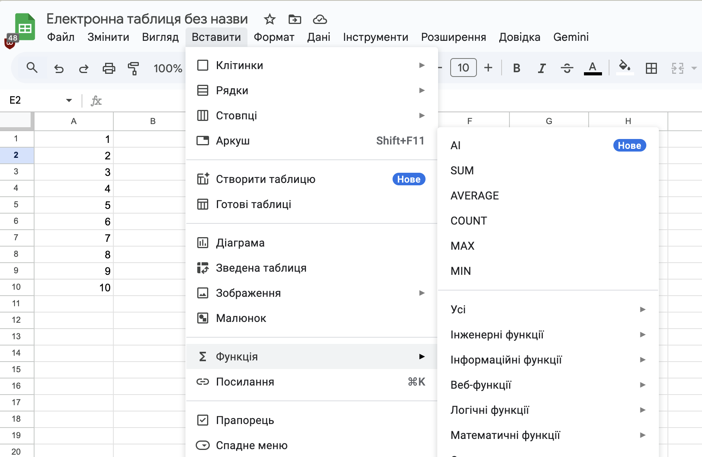

# 📊 Опрацювання табличних даних

## 🏫 Урок **20**

---

## 🧠 Актуалізація знань

**Дайте відповіді на запитання:**

1. З якого знака починається запис будь-якої формули в Excel?
2. Чим функція відрізняється від звичайної формули (наприклад, `A1+A2+...`)?
3. Які типи даних можуть зберігатися в клітинках таблиці?

---

## 📘 Що таке функція?

**Функція** — це заздалегідь визначена формула, яка виконує обчислення за заданими величинами (аргументами) у певному порядку.

**Синтаксис:**
`=НАЗВА_ФУНКЦІЇ(аргумент1; аргумент2; ...)`

<small>Примітка: у Excel/Google Sheets для української локалі аргументи розділяються крапкою з комою (;).</small>

---

## 🛠 Як вставити функцію?

1. **Вручну** ✍️
   Введіть назву функції після знака `=` у клітинці.
2. **Через меню**
   Виберіть: **Вставити → Функція**.

---

## 🖼️ Приклад вставки функції через меню

---

## 🔢 Математичні функції

- **`SUM`** — сума чисел у діапазоні
  _Приклад:_ `=SUM(A1:A10)`
- **`PRODUCT`** — добуток чисел
  _Приклад:_ `=PRODUCT(A1:A10)`
- **`ROUND`** — округлення числа
  _Приклад:_ `=ROUND(B2; 2)` (до 2 знаків після коми)

---

## 📊 Статистичні функції (1/2)

- **`AVERAGE`** — середнє арифметичне
- **`MIN`** — мінімальне значення
- **`MAX`** — максимальне значення

---

## 📊 Статистичні функції (2/2)

**`COUNTIF`** — підраховує кількість клітинок, які відповідають певній умові.

_Приклад:_ Порахувати, скільки товарів коштують більше 1000 грн:
`=COUNTIF(C2:C20; ">1000")`

<small>Примітка: у Google Sheets/Excel англійською локаллю — кома, українською — крапка з комою.</small>

