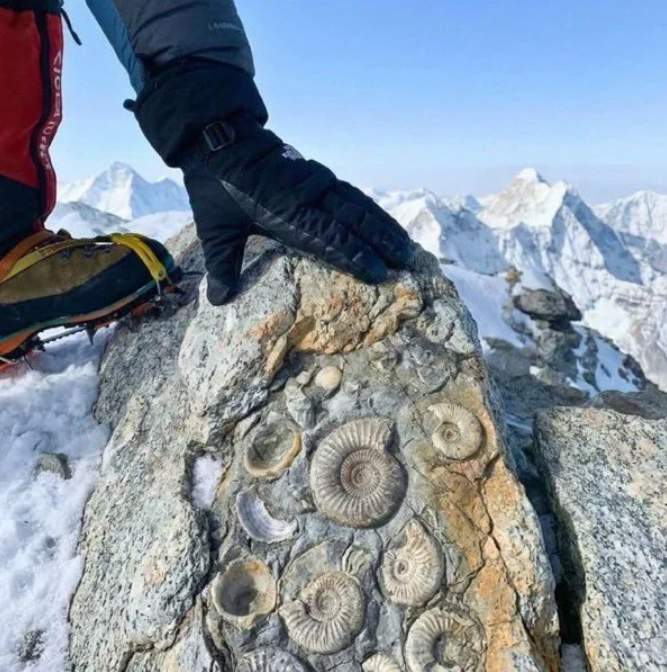

# Фактчекінг зображень. Як відрізнити справжнє фото від ШІ-генерації

## 🏫 Урок **56**

---

## 🎯 Сьогодні ми навчимося

- 🕵️ Розрізняти справжні фотографії від згенерованих штучним інтелектом.
- 🔍 Використовувати інструменти цифрової перевірки.
- 🌐 Здійснювати зворотний пошук зображень для верифікації контенту.

---

## 🧠 Що потрібно пам'ятати?

🖼️ **AI-генероване зображення** — це зображення, створене нейромережею на основі текстового запиту (промпту).

🧩 **Артефакти ШІ** — характерні помилки нейромереж (неправильна кількість пальців, дивна текстура шкіри, розмиті фони, нелогічні тіні).

⚠️ **Важливо:** автоматичні детектори можуть помилятися, тому рішення треба приймати за сукупністю ознак.

---

## 🛠 Наш інструментарій

  

    🔍

### Пошук за зображенням

[Пошук зображень Google](https://images.google.com)

  

  

    🤖

### Детектори ШІ

- [Hive Moderator](https://hivemoderation.com/ai-generated-content-detection)
- [Illuminarty](https://app.illuminarty.ai/)

  

---

## 🕵️ Практична робота: "Цифровий детектив"

**Ваша місія:** Провести дослідження двох наданих учителем фотографій та створити короткий звіт у Google Документах або MS Word.

**Що має бути у звіті:**
Оцінка кожного фото (справжнє чи ШІ), ваше обґрунтування та скриншоти перевірок через спеціальні сервіси.

---

## ⭐️ Завдання 1: Візуальний аналіз

1. **Уважно розгляньте кожне фото.** Спробуйте знайти "артефакти" ШІ (зверніть увагу на руки, волосся, фон, дивні написи та тіні).
2. **Використайте [Пошук зображень Google](https://images.google.com/)**, щоб знайти, чи публікувалося це фото раніше на надійних ресурсах.
3. **Запишіть у звіт:** "Фото №... : [Справжнє / ШІ], тому що [ваше обґрунтування висновку]".

---

## ⭐️⭐️ Завдання 2: Автоматична перевірка

1. Завантажте кожне зображення у сервіс [Hive Moderator](https://hivemoderation.com/ai-generated-content-detection) та [Illuminarty](https://app.illuminarty.ai/).
2. **Зробіть знімки екрану** результатів, де вказано ймовірність (у відсотках) того, що зображення створене ШІ, та додайте їх у звіт.
3. **Порівняйте та зробіть висновок:** чи збігається ваша власна візуальна оцінка (із Завдання 1) з результатами автоматичних детекторів?
4. **Запишіть у звіт**: "Висновок: Я вважаю, що фото №... [Справжнє / ШІ], тому що [ваше обґрунтування]"

---

## Фото для перевірки

  

  

  

  

