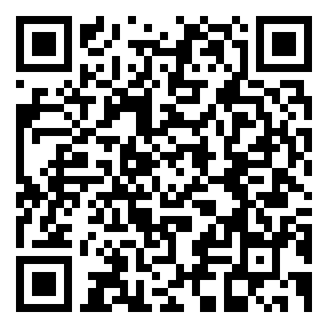
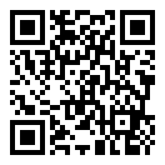

# 🎬 Налаштування часових параметрів відеоряду

## 🏫 Урок **58**

---

## 🎯 Сьогодні ми дізнаємося

- ℹ️ Що таке відеоряд і таймлайн
- ℹ️ Які часові параметри має відеоряд
- 🔧 Як обрізати кліп, змінити його тривалість і швидкість
- ✏️ Як налаштувати переходи та появу тексту у Google Vids

---

## 🗣️ Повторення — Урок 55: Мультимедіа та формати

- Що таке **мультимедіа**? Назвіть типи мультимедійних об'єктів.
- Чим відрізняється формат **MP4** від **AVI**?
- Що таке **кодек**? Навіщо він потрібен?

---

## 🗣️ Повторення — Урок 56: Захоплення аудіо

- Що таке **частота дискретизації**?
  Яке значення є стандартом для відео?
- Яке програмне забезпечення використовували для **запису та редагування аудіо**?

---

## 🗣️ Повторення — Урок 57: Захоплення відео

- Які **способи захоплення відео** ви знаєте?
- Який **сервіс** використовували на практичній роботі?
- Яка **роздільна здатність** і скільки **кадрів на секунду** у вашому відео?

---

## 🤔 Проблемна ситуація

<section class="important-to-remember">

Ви записали відео. Але воно з запланованої тривалісті **5 хвилин** перетворилось на **10 хвилин**, бо ви забули вимкнути запис.

- Як **вилучити зайве**?
- Як зробити сцену у **сповільненому режимі**?
- Як виставити правильний **хронометраж** між слайдами?

</section>

---

## 📽️ Відеоряд і таймлайн

<section class="card">

**Відеоряд (відеосеквенція)** — впорядкована послідовність відеокліпів, зображень і звуку на часовій шкалі.

</section>

<section class="card">

**Таймлайн (часова шкала)** — горизонтальна смуга, де елементи відеопроєкту розташовані у хронологічному порядку.

</section>

---

## ⏱️ Часові параметри відеоряду

<section class="text-small">

| Параметр | Що регулює | Приклад |
|---|---|---|
| **Тривалість кліпу** | скільки секунд займає елемент | кліп 3 сек → 5 сек |
| **Обрізка (Trim)** | відсікання початку або кінця кліпу | прибрати перші 10 сек |
| **Швидкість відтворення** | прискорення або сповільнення | 0.5× — сповільнення |
| **Тривалість переходу** | час ефекту між кліпами | 0.5–1 сек |
| **Затримка (Delay)** | пауза перед появою елемента | текст з'являється через 2 сек |

</section>

---

## ✂️ Обрізка кліпу (Trim)

<section class="grid-container">

**Навіщо:**
відсікти зайве на початку або наприкінці запису

**Як у Google Vids:**
1. Клацніть на кліп на таймлайні
2. Потягніть **лівий або правий край** кліпу
3. Зупиніться на потрібному кадрі

**Важливо:**
- Оригінальний файл **не змінюється**
- Обрізку можна скасувати
- ⬅️ початок &nbsp;&nbsp; кінець ➡️

</section>

---

## 🔄 Зміна тривалості та швидкості

<section class="grid-container">

**Тривалість кліпу:**
- Відкрийте налаштування кліпу (⚙️)
- Введіть нове значення у секундах
- Або потягніть край кліпу на таймлайні

**Швидкість відтворення:**
- Оберіть кліп → «Швидкість»
- **0.5×** — сповільнення (slow motion)
- **2×** — прискорення
- Тривалість на таймлайні зміниться автоматично

</section>

---

## 🎞️ Переходи між кліпами

<section class="card">

**Перехід** — візуальний ефект між двома кліпами (наприклад, розчинення або зсув).

</section>

**Як додати у Google Vids:**
1. Клацніть на **стик між двома кліпами** на таймлайні
2. Оберіть тип переходу зі списку
3. Виставте **тривалість переходу** (рекомендовано: **0.5–1 сек**)
4. Перегляньте результат

---

## 💬 Текстовий підпис із затримкою появи

**Як додати текст у Google Vids:**
1. Натисніть **«Додати текст»** (або «Вставити» → «Текст»)
2. Введіть потрібний підпис
3. На таймлайні перетягніть **лівий край** блоку тексту — це і є момент появи
4. Потягніть **правий край**, щоб налаштувати тривалість показу
5. Натисніть поза блоком для підтвердження

---

## 📁 Матеріали для практичної роботи

<section class="grid-container">

Завантаж відеофайли для завдання з Google Drive:

🔗 <a href="https://drive.google.com/drive/folders/1ifR0kYlMazrhcC9fakZJPpCJG1VROYgB?usp=sharing" target="_blank">Відкрити папку на Drive</a>

У папці: **2 відеокліпи** для монтажу

📱 Скануй QR-код телефоном

</section>

---

## ⌨️ Практична робота

<section class="task text-medium-small">

**Завдання:** зібрати короткий відеоряд у Google Vids на вільну тему

🔗 <a href="https://vids.google.com" target="_blank">vids.google.com</a>

1. Створіть новий проєкт
2. Додайте **2+ відеокліпи або зображення** на таймлайн
3. **Обріжте** один кліп
4. **Змініть тривалість** одного елемента
5. Додайте **перехід** між кліпами та виставте його тривалість
6. Додайте **текстовий підпис** та налаштуйте момент його появи
7. Перегляньте результат і **збережіть** проєкт

</section>

---

## 🎥 Відеоінструкція

<section class="grid-container">

Не знаєш, як виконати завдання?

Переглянь **покрокову відеоінструкцію** на YouTube:

🔗 <a href="https://youtu.be/hsiP2uEyBgE" target="_blank">youtu.be/hsiP2uEyBgE</a>

📱 Скануй QR-код телефоном

</section>

---

## 📋 Покроковий інструктаж — Крок 1: Новий проєкт

1. Відкрийте браузер і перейдіть на <a href="https://vids.google.com" target="_blank">vids.google.com</a>
2. Увійдіть у свій Google-акаунт
3. Натисніть **«+ Новий відеопроєкт»** (або **«Blank video»**)
4. Введіть назву проєкту (наприклад, `Урок 58 — Ваше ім'я`)
5. Натисніть **«Створити»** — відкриється редактор із порожнім таймлайном

---

## 📋 Покроковий інструктаж — Крок 2: Додавання елементів

1. Оберфіть меню **«Вставити»** потім **«Завантажити»**
2. Оберіть один з раніше завантажених відеофайлів.
3. Додайте нову сцену, та повторіть кроки 1 і 2, щоб завантажити другий файл.
4. Розташуйте елементи у потрібному порядку — просто перетягуйте їх

---

## 📋 Покроковий інструктаж — Крок 3: Обрізка кліпу

1. Клацніть на **кліп**, який потрібно обрізати — навколо нього з'явиться синя рамка
2. Наведіть курсор на **лівий або правий край** кліпу — курсор зміниться на ↔
3. **Потягніть край** до потрібного місця
   - Лівий край → обрізаєте **початок**
   - Правий край → обрізаєте **кінець**
4. Відпустіть кнопку миші — обрізка застосована

---

## 📋 Покроковий інструктаж — Крок 4: Зміна тривалості

1. Клацніть на кнопку **Показати часові мітки**
2. Клацніть на **назву кліпу**, тривалість якого хочете змінити
3. В меню **Формат** оберіть **Параметри відтворення**
4. Введіть нове значення в секундах (наприклад, **5** замість **9**)
5. Натисніть **Enter** — розмір блоку на таймлайні зміниться

> Або: просто потягніть правий край кліпу на таймлайні в потрібному напрямку

---

## 📋 Покроковий інструктаж — Крок 5: Перехід між кліпами

1. На таймлайні знайдіть **стик між двома сусідніми кліпами**
2. Клацніть на значок **переходу** (🔀) між ними
   *(або: клацніть на перший кліп → «Перехід» у правій панелі)*
3. Оберіть тип переходу зі списку (наприклад, **«Fade»** — розчинення)
4. Змініть **«Тривалість»** на панелі справа
5. Перегляньте результат, натиснувши ▶️

---

## 📋 Покроковий інструктаж — Крок 6: Текстовий підпис

1. Натисніть кнопку **«Текст»** (T) на панелі інструментів
2. Клацніть у потрібне місце на превʼю відео та **введіть текст**
3. Клацніть поза блоком для підтвердження

---

## 📋 Покроковий інструктаж — Крок 7: Збереження

1. Переконайтеся, що всі зміни застосовано
2. Натисніть кнопку **▶️ «Переглянути»**, щоб перевірити результат
3. Проєкт зберігається **автоматично** у Google Drive
4. За потреби натисніть **«Файл» → «Завантажити» → «.mp4»**

<section class="important-to-remember text-medium-small">

💡 Якщо щось пішло не так — натисніть **Ctrl+Z** для скасування останньої дії

</section>

---

## ✅ Критерії оцінювання

- ✓ Таймлайн містить **2+ елементи** (кліпи або зображення)
- ✓ Виконано **обрізку** кліпу
- ✓ Змінено **тривалість** елемента
- ✓ Додано **перехід** із налаштованою тривалістю
- ✓ Додано **текстовий підпис** із налаштованим моментом появи
- ✓ Проєкт **збережено**

---

## 🤔 Рефлексія

- Що таке **таймлайн**? Навіщо він потрібен?
- Чим відрізняється **обрізка кліпу** від зміни його **швидкості**?
- Яку **помилку** найчастіше робили при розташуванні кліпів?

---

## 🏠 Домашнє завдання

**Обов'язково:**
- Опрацювати матеріал підручника (с. 222–228)

**За бажанням:**
- Знайти **2 приклади відео** зі сповільненою зйомкою на YuoTube.
- Записати: де й навіщо цей ефект використано
