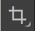
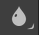
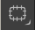

# 🖼️ Растрова графіка. Обробка растрових зображень

## 🏫 Урок *60*

---

## 🎯 Сьогодні ми дізнаємося

- 🖼️ Що таке растрова графіка та її особливості.
- 💻 Як працювати в онлайн-редакторі Photopea.
- ✂️ Як кадрувати, переміщувати та ретушувати фото.
- 🏁 Як створювати зображення з прозорим фоном (PNG).

---

## 🖼️ Растрова графіка

**Растрове зображення** — це зображення створене з кольорових точок (пікселів).

- При збільшенні виникає ефект "пікселізації" (втрата якості).
- Для збереження зображення з прозорим фоном використовується формат **PNG**.
- Дозволяє працювати з фото та створювати фотореалістичні зображення.

---

## 💻 Онлайн-редактор Photopea

Це безкоштовний графічний редактор, який працює прямо в браузері.
🌐 **[www.photopea.com](https://www.photopea.com/)**

---

## 🛠️ Інструменти Photopea

<section class="text-medium-small">

-  **Переміщення (V):** дозволяє рухати об'єкти на полотні.
-  **Кадрування (C):** обрізання зайвих країв зображення для покращення композиції.
-  **Розмиття (Blur Tool):** дозволяє розмити задній план, щоб виділити головний об'єкт.
-  **Усунення червоних очей (Red Eye Tool):** швидко виправляє дефекти від спалаху камери.
-  **Латка (Patch Tool):** допомагає прибрати дрібні дефекти або випадкові об'єкти на фоні.
-   **Освітлювач (Dodge Tool):** обережно висвітлює потрібні ділянки (наприклад, обличчя в тіні).

</section>

---

## 📝 Довідник: Кадрування та Червоні очі

 **Кадрування (Crop - C)**

1. Виберіть інструмент кадрування на панелі ліворуч.
2. Потягніть за маркери на кутах рамки, щоб виділити головне, відрізавши зайве.
3. Натисніть **Enter** або галочку на верхній панелі для підтвердження.

 **Червоні очі (Red Eye Tool)**

1. Натисніть праву кнопку миші на інструменті "Точковий пензель відновлення" (значок пластиру).
2. Виберіть **Red Eye Tool**.
3. Просто клікніть лівою кнопкою миші по червоних зіницях на фото.

---

## 📝 Довідник: Розмиття та Латка

 **Розмиття (Blur Tool)**

1. Знайдіть значок краплі на панелі.
2. Зверху налаштуйте: Жорсткість (Hardness) **0%**, Інтенсивність (Strength) **50-70%**.
3. Затисніть мишу та акуратно "замалюйте" фон, не торкаючись головного об'єкта.

 **Латка (Patch Tool)**

1. Знаходиться в групі інструментів "Пластиру".
2. Обведіть зайвий об'єкт на фоні (замкніть лінію виділення).
3. Наведіть курсор всередину виділеного і перетягніть на чисту сусідню ділянку фону.

---

## 📝 Довідник: Освітлювач та Прозорий фон

 **Освітлювач (Dodge Tool)**

1. Знайдіть значок шпильки 📍 (в групі з "рукою").
2. Налаштування зверху: Жорсткість **0%**, Діапазон **Середні тони**, Експозиція **20%**.
3. Плавно проведіть по темних ділянках (тінях) на обличчі для їх висвітлення.

**🏁 Прозорий фон (PNG)**

1. Виділіть фон (наприклад, інструментом *Чарівна паличка - W*).
2. Натисніть клавішу **Delete** (замість фону має з'явитися шахівниця).
3. Збережіть: *Файл -> Експортувати як -> **PNG***.

---

## 💻 Практична робота

**⭐️ Достатній рівень (до 6 балів)**

1. Відкрийте **[www.photopea.com](https://www.photopea.com/)** та завантажте [фото](https://drive.google.com/file/d/1Vt_jbYLnMF3g7DIx03-sj73bOXVfYdKf/view?usp=sharing)
2. Використовуйте інструмент **Кадрування (Crop)**, щоб покращити композицію (прибрати зайве з боків).
3. Збережіть результат як JPG (*Файл -> Експортувати як -> JPG*).

---

## 💻 Практична робота

**⭐️⭐️ Середній рівень (до 9 балів)**

1. Виконайте завдання достатнього рівня.
2. Використовуйте інструмент **Розмиття (Blur tool)**, щоб розмити фон за основним об'єктом.
3. Також, на фото є ефект червоних очей — виправте його інструментом **Red Eye Tool**.
4. Збережіть проект (*Файл -> Зберегти як PSD*)

---

## 💻 Практична робота

**⭐️⭐️⭐️ Високий рівень (до 12 балів)**

1. Виконайте завдання середнього рівня.
2. Використовуйте інструмент **Латка (Patch Tool)**, щоб прибрати дрібні дефекти на фоні.
3. Використовуйте інструмент **Освітлювач (Dodge Tool)**, щоб висвітлити обличчя.
4. Спробуйте видалити фон навколо основного об'єкта та збережіть результат у форматі **PNG** (для прозорості).

