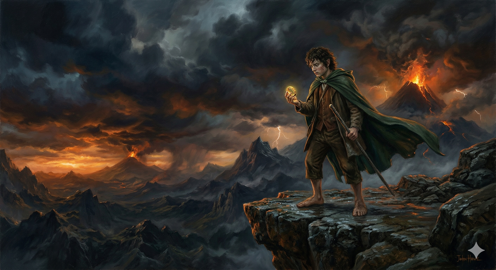

# Штучний інтелект та зображення

## Етичні норми використання згенерованих зображень

## 🏫 Урок **61**

---

## 🎯 Сьогодні ми дізнаємося

- 🤖 Як ШІ створює зображення з "хаосу".
- 📝 Як правильно писати запити (промпти).
- ⚖️ Яких етичних правил слід дотримуватися.
- 🎨 Створимо власну ілюстрацію до книги чи фільму.

---

## 🧐 Актуалізація: ШІ чи Реальність?

  

**Завдання:** Відскануйте QR-код та пройдіть вікторину.

Спробуйте вгадати: де справжнє фото, а де робота нейромережі?

  

  

  

---

## ⚙️ Як працює генеративний ШІ?

Сучасні ШІ (DALL-E, Midjourney) використовують **дифузійні моделі**.

1. **Шум:** ШІ починає з абсолютно випадкового набору кольорових крапок.
2. **Очищення:** Крок за кроком він прибирає "шум", шукаючи в ньому форми, які ви описали словами.
3. **Результат:** З хаосу постає чітка картинка.

---

## 📝 Занотуйте в зошит: Конструктор промпту

Щоб ШІ вас зрозумів, запит (промпт) має бути структурованим:

1. **Об’єкт** (Хто? Що?) — головний герой.
2. **Дія** (Що робить?) — поза або сюжет.
3. **Стиль** (Як виглядає?) — художня техніка.
4. **Деталі** (Оточення) — фон, світло, кольори.

---

## 🎨 Обираємо стиль (Приклади)

Використовуйте ці назви у своїх запитах:

  

**Cyberpunk**

Майбутнє, неонові вогні

  

  

**Pixar style**

3D мультфільм

  

  

**Watercolor**

Ніжна акварель

  

  

**Sketch**

Начерк олівцем

  

---

## 💡 Світло та Деталі

Додайте атмосфери вашій роботі:

  

**Golden hour**

Тепле світло заходу сонця.

  

  

**Neon glow**

Яскраве нічне сяйво.

  

  

**Cinematic**

Вигляд як у професійному кіно.

  

  

**High detail**

Дуже багато дрібних елементів.

  

---

## ✍️ Приклад промпту: «Володар Перснів»

Застосуємо конструктор до реальної книги:

| Частина | Приклад |
|---|---|
| **Об'єкт** | Фродо Торбин, молодий гобіт |
| **Дія** | стоїть на краю скелі та тримає Перстень |
| **Стиль** | олійний живопис, у стилі Джона Хоу |
| **Деталі** | похмуре небо, відблиски вогню, епічне кінематографічне освітлення |

> **Готовий промпт:** *Фродо, молодий гобіт, стоїть на краю скелі та тримає Перстень Всевладдя, олійний живопис у стилі Джона Хоу, похмуре штормове небо, відблиски вогню, епічне кінематографічне освітлення, висока деталізація*

---

## Зображення створене на основі промпту

---

## ⚖️ Етика та правила

- **Маркування:** Етично додавати примітку "Згенеровано ШІ".
- **Ні фейкам:** Заборонено створювати зображення для обману людей (діпфейки).
- **Повага до авторів:** Не видавайте роботу ШІ за свій особистий малюнок від руки.

---

## 🚀 Практична робота

**Завдання:** Створити ілюстрацію до улюбленої книги або фільму.

1. Оберіть сцену або персонажа.
2. Складіть промпт: **Об'єкт + Дія + Стиль + Деталі**.
3. Відкрийте **Microsoft Designer** або **Bing Image Creator**.
4. Згенеруйте результат та продемонструйте вчителю.

---

## 💬 Рефлексія

- Чи легко було підібрати слова, щоб ШІ вас зрозумів?
- Чи відрізняється результат від того, що ви малювали в уяві?
- Чи вважаєте ви себе "автором" цього зображення?

---

## 🏠 Домашнє завдання

1. **Роздуми:** Напишіть 2-3 речення на тему: *"Чому важливо позначати зображення від ШІ у стрічці новин?"*
2. **Опрацювати** конспект уроку.
