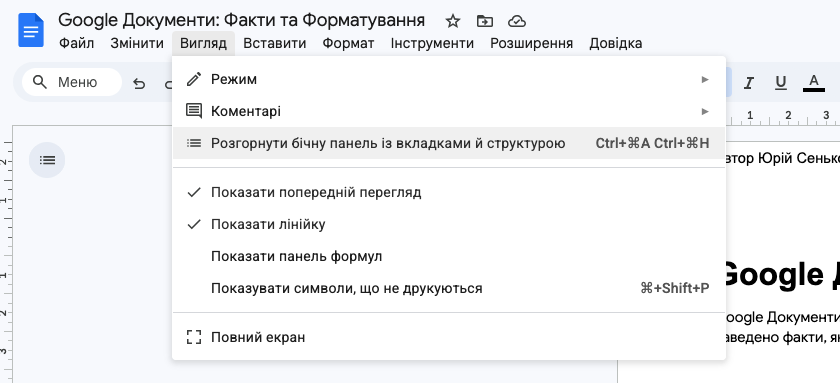

# 📄 Структура документа. Гіперпосилання. Автоматичний зміст.

## 🏫 Урок **63**

---

## 🎯 Сьогодні ми дізнаємося

- 🏗️ Як створювати ієрархічну **структуру документа**.
- 📑 Як працювати з **панеллю структури** у Документах Google.
- 📌 Що таке **закладки** та як їх використовувати.
- 🔗 Як додавати внутрішні та зовнішні **гіперпосилання**.
- ⚡ Як автоматично створити **зміст документа** за 2 кліки.

---

## 🤔 Проблемна ситуація

Уявіть, що перед вами документ на 100 сторінок без жодного заголовка.

- 🔍 Як знайти потрібний розділ?
- ⏳ Скільки часу це займе?
- 🤯 Чи зручно це читати?

**Рішення:** Використання стилів заголовків та автоматизації.

---

## 🏗️ Структура документа

**Структура документа** — це ієрархічна схема побудови документа, яка відображає його поділ на розділи, підрозділи, пункти тощо.

У Документах Google структура базується на **Стилях заголовків**:
- **Заголовок 1** — назви розділів.
- **Заголовок 2** — назви підрозділів.
- **Заголовок 3** — пункти всередині підрозділів.

---

## 📑 Панель структури

<section class="grid-container">

Щоб увімкнути панель структури:
1. Перейдіть у меню **Вигляд**.
2. Оберіть **Показати структуру документа** (назва може трохи відрізнятися залежно від оновлень інтерфейсу).

Ліворуч з'явиться панель, де можна миттєво переходити між розділами, просто клікаючи по заголовках.

</section>

📌 *Порада:* Якщо заголовка немає в структурі, перевірте, чи застосовано до нього стиль "Заголовок".

---

## 📌 Закладки (Bookmarks)

**Закладка** — це посилання на певне місце в документі, яке не обов'язково є заголовком.

**Як додати закладку:**

1. Поставте курсор у потрібне місце.
2. Меню **Вставити** → **Закладка**.
3. З'явиться синій прапорець — тепер на це місце можна створити посилання.
4. Також закладки видно в бічній панелі зі структурою.

---

## 🔗 Гіперпосилання

**Гіперпосилання** може вести на:

- 🌐 Вебсторінку в Інтернеті.
- 📂 Інший файл у Google Drive.
- 📍 **Заголовок** або **Закладку** всередині цього ж документа.

**Гарячі клавіші:** `Ctrl + K`

---

## ⚡ Автоматизований зміст

<section class="grid-container">

**Зміст** формується автоматично на основі заголовків.

**Як додати:**

1. Вставте курсор там, де має бути зміст.
2. Меню **Вставити** → **Зміст**.
3. Оберіть тип:
   - Звичайний текст.
   - Пунктирні (з крапками)
   - Посилання

🔄 Не забудьте натиснути кнопку **Оновити зміст** після редагування заголовків!

</section>

---

## ⌨️ Практичне завдання: "Редактор вікі-статті"

<section class="task text-small">

1. Відкрийте у Документах Google статтю з Вікіпедії:
  <a href="https://uk.wikipedia.org/wiki/%D0%86%D1%81%D1%82%D0%BE%D1%80%D1%96%D1%8F_%D1%80%D0%BE%D0%B7%D0%B2%D0%B8%D1%82%D0%BA%D1%83_%D1%86%D0%B5%D0%BD%D1%82%D1%80%D0%B0%D0%BB%D1%8C%D0%BD%D0%B8%D1%85_%D0%BF%D1%80%D0%BE%D1%86%D0%B5%D1%81%D0%BE%D1%80%D1%96%D0%B2" target="_blank">Історія розвитку центральних процесорів</a>

2. Застосуйте стилі:
   - **Заголовок 1** — до заголовка статті
   - **Заголовок 2** — до підрозділів

3. Знайдіть текст про ARM у 2021 році та додайте **Закладку** на цей момент.
4. На початку документа створіть гіперпосилання, що адресує цю закладку.
5. Додайте посилання на оригінальну статтю в Вікіпедії.
6. Вставте **Автоматичний зміст** на першій сторінці та перевірте, чи побудований коректно.

</section>

---

## 🤔 Рефлексія

- 1️⃣ Яка різниця між заголовком і закладкою?
- 2️⃣ Чому зміст називають "автоматизованим"?
- 3️⃣ Як додати гіперпосилання за допомогою клавіатури?
- 4️⃣ Коли краще використовувати зміст із номерами сторінок, а коли — з посиланнями?

---

## 🏠 Домашнє завдання

1. 📒 Опрацювати матеріал уроку.
2. 📖 Опрацювати с. 199-202 з підручника.
