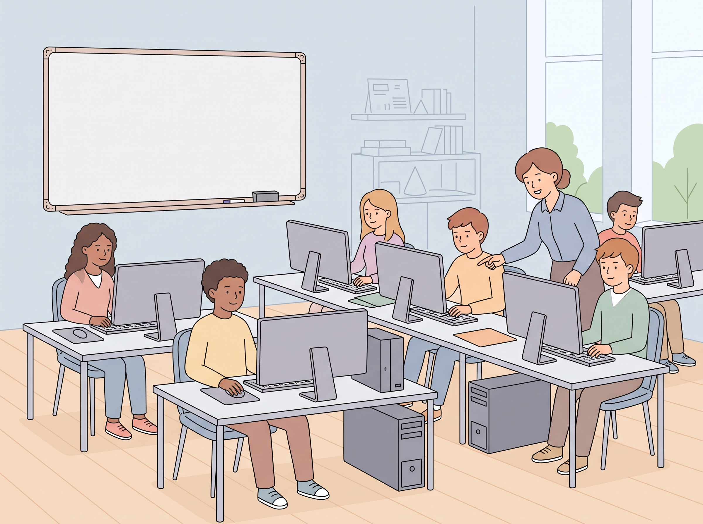
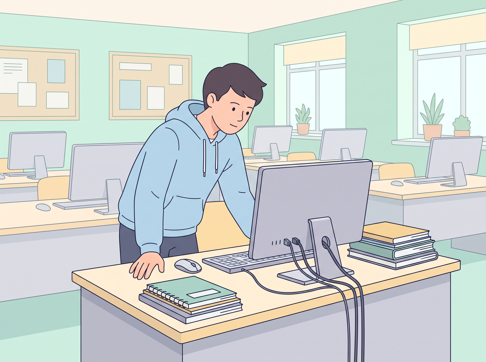
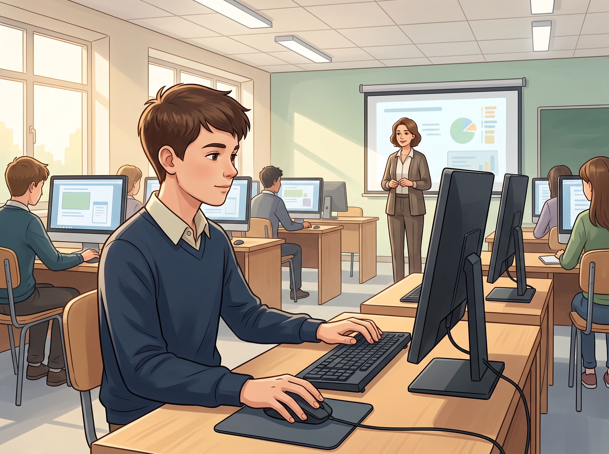
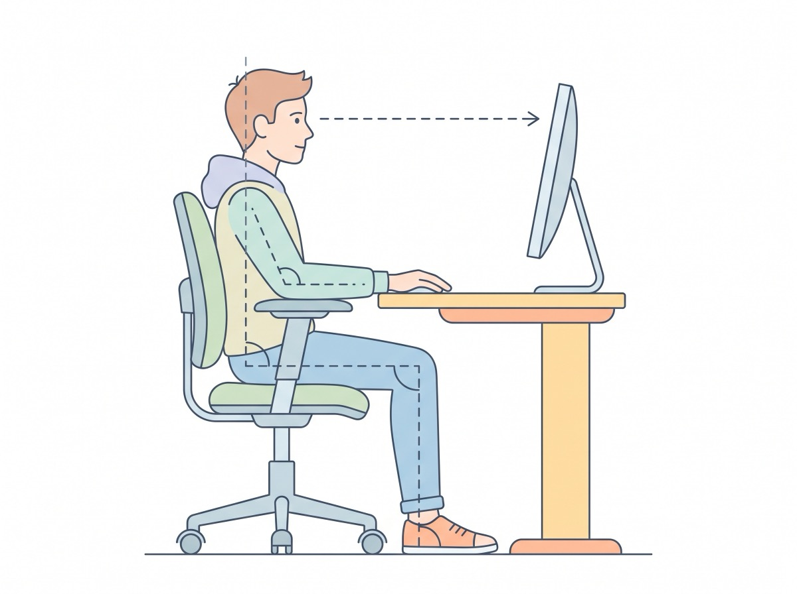
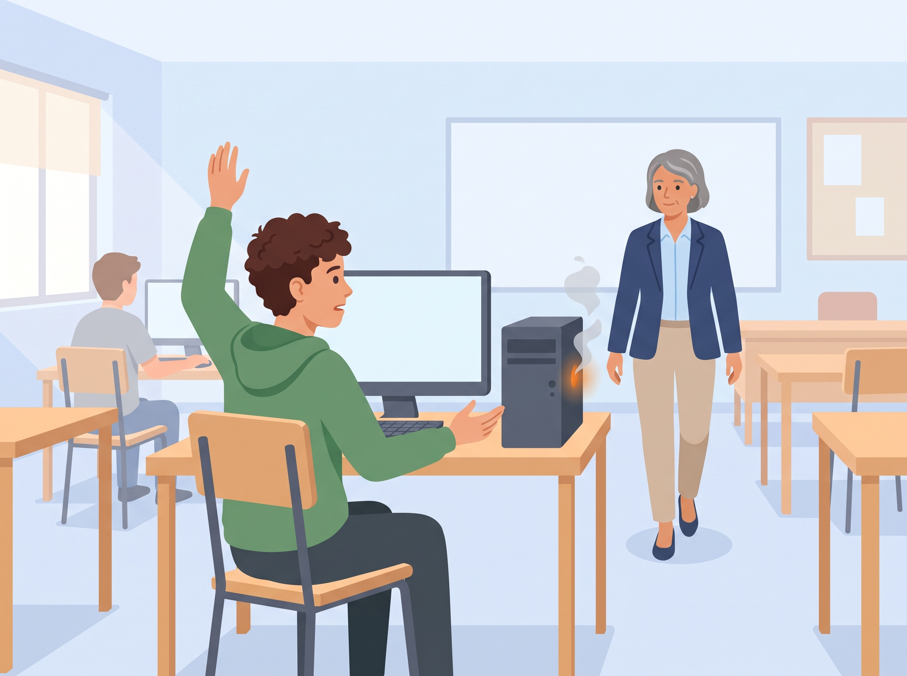
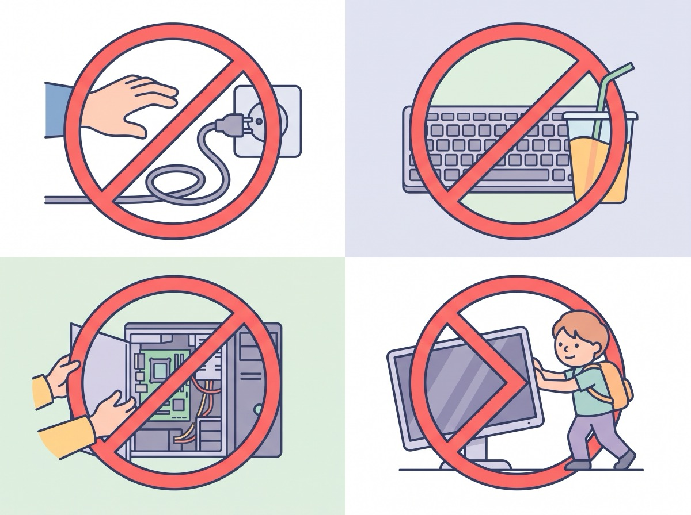
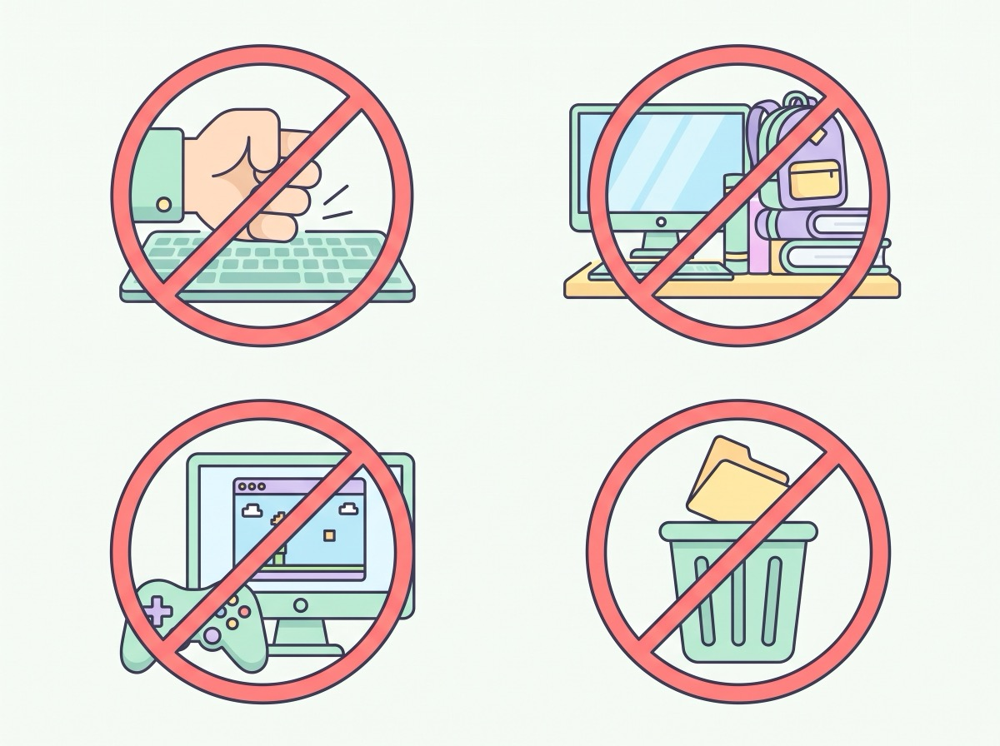

# Правила поведінки та техніки безпеки в кабінеті інформатики

## 🏫 Урок **01**

---

## 🎯 Сьогодні ми дізнаємося

- ℹ️ Основні правила техніки безпеки в кабінеті інформатики
- 🖥️ Правила роботи за комп’ютером
- 🚫 Що суворо заборонено робити в кабінеті інформатики
- 📝 Позначимо правила, які потрібно занотувати в зошит

---

## Основні правила техніки безпеки в кабінеті інформатики

**Загальні положення**

- До роботи в кабінеті допускаються учні, ознайомлені з цією інструкцією.
- Робота дозволена лише в присутності вчителя.
- Кожен учень відповідає за стан свого робочого місця та збереження обладнання.

---

## Основні правила техніки безпеки в кабінеті інформатики

**Перед початком роботи необхідно:**

- переконатися у відсутності видимих пошкоджень на робочому місці, перевірити стан компʼютера;
- сісти рівно, дотримуючись відстані до екрану.

---

## Правила роботи за комп’ютером

**Під час роботи учень зобов’язаний:**

- дотримуватися тиші та порядку;
- виконувати вимоги вчителя;
- дотримуватися режиму роботи за комп’ютером;
- після завершення роботи закрити всі програми;
- залишити робоче місце чистим.

---

## Правила роботи за комп’ютером

**Сидимо за компʼютером правильно:**

- відстань від екрана до очей — 70–80 см (довжина витягнутої руки);
- спина вертикально пряма;
- плечі опущені й розслаблені;
- ноги на підлозі, не схрещені;
- лікті, зап’ястя й кисті рук — на одному рівні.

---

## Правила роботи за комп’ютером

**Дії в аварійних ситуаціях:**

- у разі програмної помилки або збою обладнання — негайно повідомити вчителя;
- якщо з’явився запах гару або незвичний звук — негайно припинити роботу й повідомити вчителя.

---

## 🚫 Суворо заборонено (1/2)

1. Перебувати в класі у верхньому одязі.
2. Класти одяг і сумки на столи.
3. Перебувати в класі з напоями та їжею.
4. Торкатися задньої частини монітора чи системного блока.
5. Приєднувати чи від’єднувати кабелі, чіпати роз’єми, дроти й розетки.
6. Пересувати комп’ютери й монітори.
7. Відкривати системний блок.

---

## 🚫 Суворо заборонено (2/2)

8. Вмикати й вимикати комп’ютери самостійно.
9. Перекривати вентиляційні отвори системного блока та монітора.
10. Бити по клавіатурі, безцільно натискати клавіші.
11. Класти книги, зошити та інші речі на клавіатуру, монітор, системний блок.
12. Видаляти або переміщати чужі файли.

---

## ✅❌ Практична вправа «Правильно чи неправильно?»

Визначте, чи правильно вчинив учень, і назвіть правило, яке порушено або дотримано:

1. Поставив стакан із соком поруч із клавіатурою.
2. Побачив дим із системного блока — одразу покликав учителя.
3. Самостійно відкрив системний блок, щоб подивитися, що всередині.
4. Сів працювати за комп’ютером на відстані витягнутої руки від екрана.
5. Підійшов до однокласника ззаду й торкнувся задньої панелі його монітора, щоб подивитися роз’єми.

---

## 🤔 Рефлексія

- Яке з правил здалося вам найбільш неочікуваним?
- Чому важливо повідомляти вчителя навіть про незначну несправність?
- 📖 Не забудьте розписатися в журналі реєстрації інструктажів з техніки безпеки!

---

## 🏠 Домашнє завдання

- Занотувати в зошит виділені на уроці правила (📝), якщо не встигли зробити це на уроці.
