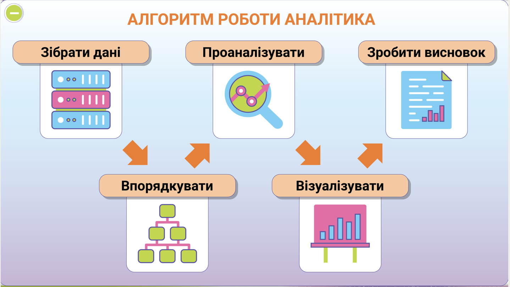

# Професія: аналітик даних

## 🏫 Урок **03**

---

## 🛡️ Пригадуємо: техніка безпеки

- 🖥️ Сідаємо рівно, відстань до екрана — довжина витягнутої руки.
- 🚫 Без їжі, напоїв та верхнього одягу в кабінеті інформатики.
- 🔌 Не чіпаємо кабелі, роз'єми, задню панель монітора чи системного блока.
- ⚡ Не вмикаємо/вимикаємо комп'ютер самостійно, не відкриваємо системний блок.
- 🔥 Побачили дим, почули незвичний звук або сталася помилка — одразу повідомляємо вчителя.

---

## 🎯 Сьогодні ми дізнаємося

- 🕵️ Хто такий аналітик даних і чим він займається.
- 🔄 З яких кроків складається алгоритм роботи аналітика.
- 🛠️ Які навички потрібні для цієї професії.
- ❓ Як відрізнити факти про професію від стереотипів.

---

## 🔁 Пригадаймо урок 2

- Що таке цифровий слід і чому важливо про нього думати?
- Наведіть приклад технології, яка непомітно працює у фоновому режимі в одній зі сфер життя.
- Яку професію майбутнього ви обрали для дослідження минулого разу і чому?

---

## 🤔 Скільки даних ви вже зустріли сьогодні?

Кроки в телефоні, оцінка в щоденнику, прогноз погоди, кількість лайків, результат гри...

Щодня навколо нас народжуються мільйони даних. Але самі по собі вони не мають цінності, доки хтось не навчиться їх збирати, впорядковувати й пояснювати.

---

## ❓ Проблемне питання

Які навички потрібні, щоб працювати аналітиком даних, і як їх можна здобути вже зараз?

---

## 🕵️ Хто такий аналітик даних?

**Аналітик даних** — людина, яка вміє «читати» дані так, як інші читають книги. Вона перетворює цифри на історії, що допомагають ухвалювати рішення в бізнесі, спорті, медицині, освіті.

▶️ [Переглянути відео: хто такі аналітики даних](https://edodatok.faino.dev/9/inform/1/part1/2/Payload/1.1.1/OEBPS/assets/video/video_project2_2.mp4)

---

## 🔄 Алгоритм роботи аналітика

---

## 🔄 Алгоритм роботи аналітика: кроки

1. 🗄️ **Зібрати дані** — знайти джерела: таблиці, опитування, бази даних.
2. 🌳 **Впорядкувати** — розкласти дані за категоріями, прибрати помилки.
3. 🔍 **Проаналізувати** — знайти закономірності, порівняти показники.

4. 📊 **Візуалізувати** — побудувати графіки й діаграми, щоб дані було легко зрозуміти.
5. 📝 **Зробити висновок** — сформулювати результат, який допоможе ухвалити рішення.

---

## 🛠️ Які навички потрібні аналітику?

▶️ [Переглянути відео: навички дата-аналітика](https://edodatok.faino.dev/9/inform/1/part1/2/Payload/1.1.1/OEBPS/assets/video/video_project2_3.mp4)

🗃️ **SQL** — отримувати потрібні дані з баз даних.

📈 **Excel** — упорядковувати дані, робити розрахунки.

📊 **Візуалізація** — перетворювати таблиці на наочні графіки й діаграми.

Ці навички доповнюють одна одну: SQL допомагає дістати дані, Excel — обробити їх, візуалізація — показати результат зрозуміло.

---

## ❓ Правда чи стереотип?

💬 «Аналітик обов'язково має бути програмістом»

💬 «Аналітики працюють лише в офісі мовчки, не спілкуючись з людьми»

Обидва твердження — стереотипи. Аналітик більше працює з даними, ніж із кодом, і часто представляє результати команді чи керівництву.

---

## 🖱️ Вікторина: чи можна перевірити це твердження?

Перейдіть за посиланням на вікторину, яке надасть учитель. Для кожної гіпотези потрібно визначити, чи можна перевірити її за допомогою даних.

---

## 🗣️ Рефлексія

- Що нового ви дізналися про професію аналітика даних?
- Який крок алгоритму роботи аналітика здався вам найскладнішим? Чому?
- Чи змінилося ваше уявлення про цю професію після сьогоднішнього уроку?

---

## 🏠 Домашнє завдання

1. Опрацювати підручник: с. 17–18 (вступ до проєкту 2 та Етап 1 «Хто такі аналітики даних?»).
2. Виконати Завдання 2 (с. 18): обрати істинні гіпотези серед поданих тверджень і сформулювати власну гіпотезу за зразком «Я думаю, що… бо…». Результати записати в зошит.

