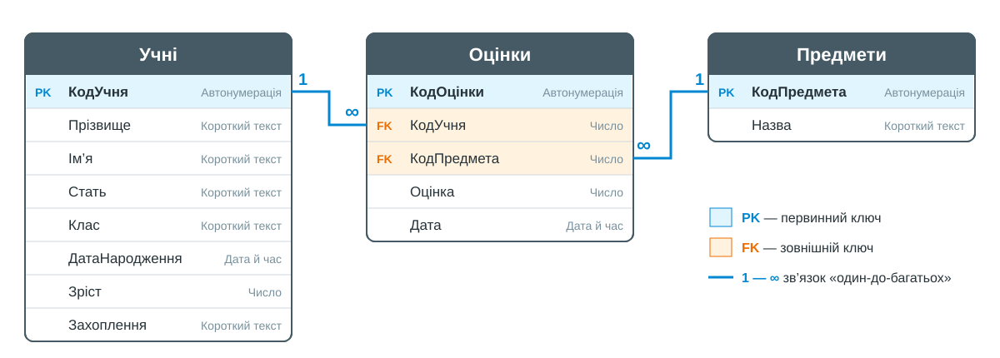

# Фільтрація та сортування даних у таблицях з використанням СУБД MS Access

## 🏫 Урок **11**

---

## 🛡️ Пригадуємо: техніка безпеки

- 🖥️ Сідаємо рівно, відстань до екрана — довжина витягнутої руки.
- 🚫 Без їжі, напоїв та верхнього одягу в кабінеті інформатики.
- 🔌 Не чіпаємо кабелі, роз'єми, задню панель монітора чи системного блока.
- ⚡ Не вмикаємо/вимикаємо комп'ютер самостійно, не відкриваємо системний блок.
- 🔥 Побачили дим, почули незвичний звук або сталася помилка — одразу повідомляємо вчителя.

---

## 🎯 Сьогодні ми навчимося

- 🔍 Швидко знаходити потрібний запис у таблиці.
- 🔃 Сортувати дані за зростанням і спаданням.
- 🧹 Відбирати записи за допомогою чотирьох типів фільтрів MS Access.
- 🔗 Задавати умови, пов'язані логічними операціями **І** та **АБО**.

---

## 📝 Перевіряємо домашнє завдання

**Завдання 18–19.** У парах по черзі представте одне одному свою логічну модель бази даних **Школа**.

Перевірте в моделі партнера:

- ✅ чи має кожна таблиця **первинний ключ (PK)**;
- ✅ чи записано **зовнішні ключі (FK)** у правильних таблицях;
- ✅ чи проведено зв'язки «**один-до-багатьох**» між ключовими полями.

---

## ⚡ Пригадаймо

1. Чим **сортування** відрізняється від **фільтрування**?
2. Чи **зникають дані** з таблиці після застосування фільтра?
3. Як швидко знайти потрібне прізвище в таблиці на **1000 рядків**?

💡 Ви вже фільтрували та сортували дані в **Google Таблицях** — в MS Access усе працює схоже!

---

## 🗺️ Наша база даних «Успішність»

🤔 Назвіть первинні та зовнішні ключі. Чому обидва зв'язки — «**один-до-багатьох**»?

---

## 🔍 Пошук запису

**Основне → Знайти** або **Ctrl+F**

- **Знайти** — шукане значення (наприклад, прізвище);
- **Шукати в** — поточне поле або весь документ;
- **Зіставити** — *усе поле* / *будь-яка частина поля* / *початок поля*.

Натискайте **Знайти далі**, щоб перейти до наступного збігу.

**Сортування** — кнопки на вкладці **Основне**, група **Сортування й фільтр**:

- 🔼 **За зростанням** (А→Я, 1→9);
- 🔽 **За спаданням** (Я→А, 9→1);
- ↩️ **Видалити сортування**.

Спочатку встановіть курсор у потрібне **поле**!

---

## 🧹 Який фільтр обрати?

| Мені потрібно... | Фільтр | Приклад з бази «Успішність» |
|---|---|---|
| відібрати записи з **таким самим значенням**, яке я бачу в таблиці | **За виділеним** | Захоплення = «комп'ютери» |
| **порівняти** значення: початок чи частина тексту, більше / менше, діапазон | **Текстові / числові фільтри** | прізвище починається на «К»; оцінка ≥ 9 |
| відібрати записи, у яких поле має **одне з кількох** значень (**АБО**) | **Змінити фільтр** | музика **АБО** література |
| задати **кілька умов** у різних полях і одразу **відсортувати** результат | **Розширений фільтр** | 9-А, зріст ≥ 170, за прізвищем |

💡 Простий спосіб: значення є перед очима → **за виділеним**; потрібне порівняння → **текстові / числові**; «або» → **Змінити фільтр**; складна умова + сортування → **розширений**.

---

## 🧭 Де знайти фільтри

| Фільтр | Як викликати |
|---|---|
| **За виділеним** | курсор у клітинку зі значенням → **Основне → Виділення** |
| **Текстові / числові** | контекстне меню поля → **Текстові фільтри** / **Фільтри чисел** |
| **Змінити фільтр** | **Основне → Додатково → Змінити фільтр** → вкладки **Шукати** та **Або** |
| **Розширений** | **Основне → Додатково → Розширений фільтр/сортування** |

🔗 Кілька фільтрів у **різних полях** поспіль поєднуються через **І** — мають виконуватися всі умови одночасно.

🔎 Значок фільтра в заголовку поля показує, що фільтр **діє**. Скасувати: **Очистити фільтр у...** або **Видалити фільтр**.

---

## 🔗 Умови І та АБО

**І** — мають виконуватися **всі** умови одночасно

👧 Стать = «ж» **І** Захоплення = «спорт»

➡️ лише учениці, які захоплюються спортом

*Кілька фільтрів за виділеним поспіль*

**АБО** — достатньо, щоб виконувалася **хоча б одна** умова

🎵 Захоплення = «музика» **АБО** «література»

➡️ усі, хто любить музику, і всі, хто любить літературу

*Змінити фільтр → вкладка Або*

🧠 Фільтр **не змінює і не видаляє** дані — він лише тимчасово приховує записи, що не відповідають умові.

---

## 🗄️ Практична робота: підготовка

1. 📥 Завантажте базу даних **Успішність.accdb**: [посилання на Google Диск](https://drive.google.com/file/d/1ZW1FIDDtbhiWfY5hD3E34EgnE_aSGZI6/view?usp=sharing)
2. 💾 Збережіть файл у своїй теці **База даних** і відкрийте його.
3. 🔓 Якщо з'явиться попередження системи безпеки — натисніть **Увімкнути вміст**.
4. ✍️ Відповіді (кількість записів, прізвища) записуйте в **зошит**.

🧹 Перед кожним новим завданням **очищайте попередній фільтр**!

📊 Середній рівень (1–3) — 4–6 балів · Достатній (4–6) — 7–9 балів · Високий (7–8) — 10–12 балів

---

## 🖱️ Середній рівень

1. 🔍 За допомогою **Знайти** знайдіть у таблиці **Учні** учня з прізвищем **Гнатюк**. У якому він класі та яке його захоплення?
2. 🔃 Відсортуйте таблицю **Учні** за прізвищем від А до Я. Хто **перший** у списку? Потім відсортуйте за полем **Зріст** за спаданням. Хто **найвищий**?
3. 🧹 **Фільтром за виділеним** відберіть учнів, які захоплюються **комп'ютерами**. Скільки їх?

💡 Завдання 3: клацніть у клітинку зі значенням «комп'ютери» → **Виділення** → **Дорівнює "комп'ютери"**.

---

## 🖱️ Достатній рівень

4. 👧 Послідовно застосуйте два фільтри за виділеним: **Стать** = «ж», **Захоплення** = «спорт». Скільки учениць захоплюються спортом? Назвіть їхні прізвища.
5. 🔤 Текстовим фільтром **Починається з...** відберіть учнів, прізвища яких починаються на «**К**». Скільки їх?
6. 🔢 У таблиці **Оцінки** застосуйте **Фільтри чисел → Більше ніж або дорівнює** 9 і відсортуйте результат за полем **КодПредмета** за зростанням. Скільки оцінок 9 балів і вище? З якого предмета їх **найбільше**?

---

## 👀 Пауза для очей

Відведіть погляд від екрана. Подивіться на найдальший предмет у кабінеті, потім — на найближчий. Повторіть кілька разів.

---

## 🖱️ Високий рівень

7. 🎵 За допомогою **Додатково → Змінити фільтр** і вкладки **Або** відберіть учнів, які захоплюються **музикою АБО літературою**. Скільки їх?
8. 📐 За допомогою **Додатково → Розширений фільтр/сортування** відберіть учнів класу **9-А** зі зростом **не менше 170 см**, упорядкованих за прізвищем. Запишіть прізвища в отриманому порядку.

💡 Завдання 7: у вкладці **Шукати** оберіть у полі *Захоплення* «музика», у вкладці **Або** — «література» → **Застосувати фільтр**.
💡 Завдання 8: у бланку розширеного фільтра додайте поля *Клас* (умова `"9-А"` — у лапках!), *Зріст* (умова `>=170`) і *Прізвище* (сортування *за зростанням*) → **Застосувати фільтр**.

---

## ✅ Перевіряємо

| № | Відповідь |
|---|---|
| 1 | Гнатюк Остап — **9-А**, **комп'ютери** |
| 2 | Перша — **Антонюк**; найвищий — **Марченко** (183 см) |
| 3 | **6** учнів |
| 4 | **3** учениці: Мельник, Козак, Яковенко |
| 5 | **6** учнів: Коваленко, Кравчук, Кузьменко, Козак, Кириленко, Климчук |
| 6 | **23** оцінки; найбільше — з **англійської мови** (6) |
| 7 | **9** учнів |
| 8 | Гнатюк, Климчук, Коваленко, Савченко |

---

## ⚠️ Типові помилки

- 🧹 Не очистили **попередній фільтр** — і результат «з'їв» нову умову.
- 🔗 Переплутали **І** та **АБО**.
- 🔢 Обрали **«Менше або дорівнює»** замість **«Більше ніж або дорівнює»**.

---

## 🗣️ Рефлексія

- 🤔 Чим умова **І** відрізняється від умови **АБО**? Яким фільтром задається кожна з них?
- 🗄️ Чи змінилися дані в базі після фільтрування?
- 💬 Який фільтр виявився для вас найзручнішим? А найскладнішим?

---

## 🏠 Домашнє завдання

1. 📖 Опрацювати підручник: с. 44–51.
2. ✏️ **Завдання 30 (с. 50–51):** письмово наведіть 2–3 **спільні риси** та 2–3 **відмінності** роботи фільтрів у табличному процесорі та СКБД MS Access.
3. 🔎 Прочитайте про **запити** (с. 51) і дайте відповідь: чим **запит на вибірку** відрізняється від **фільтра**?

